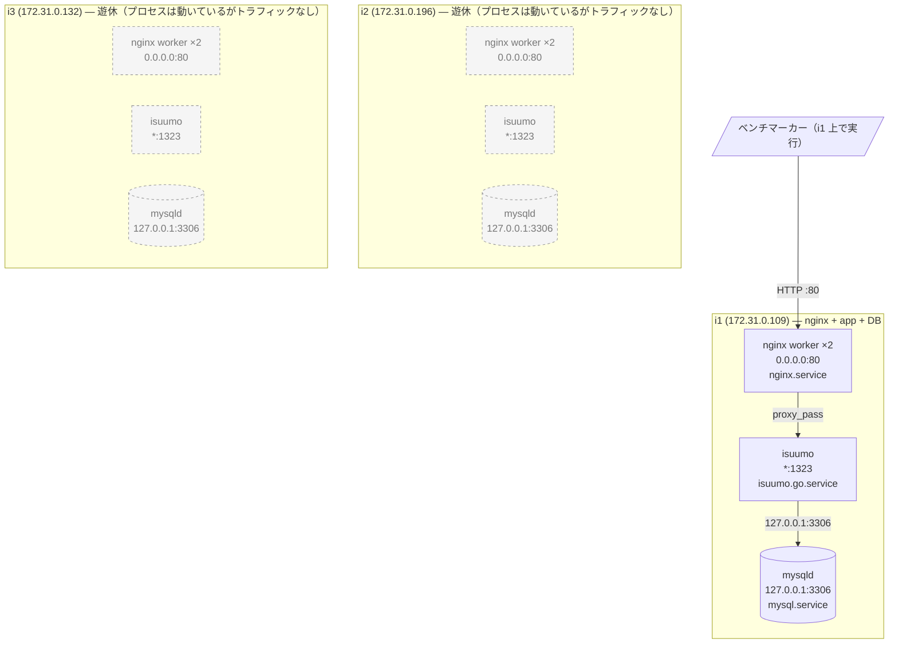
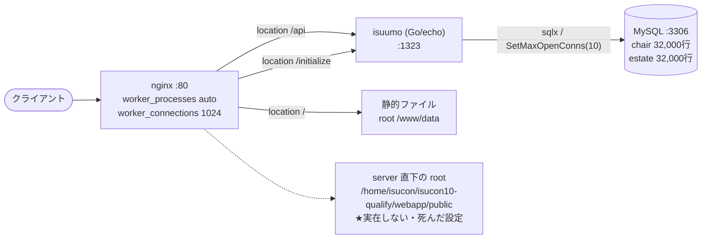
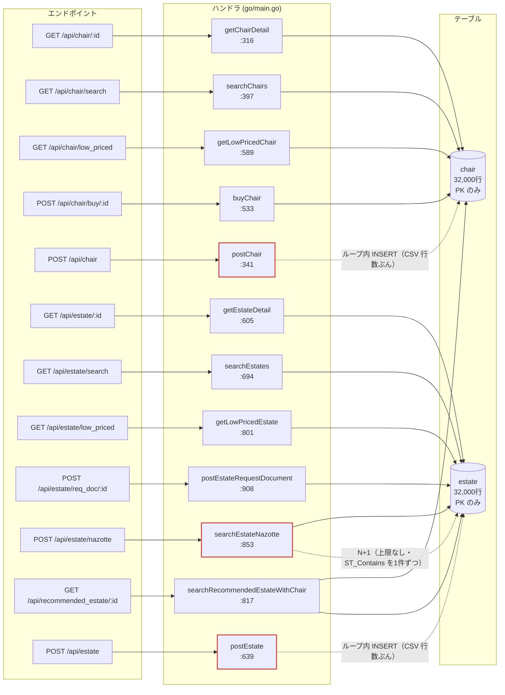
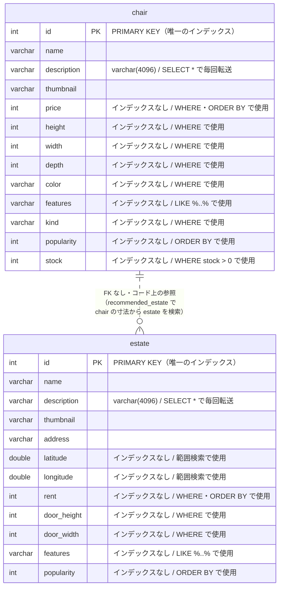
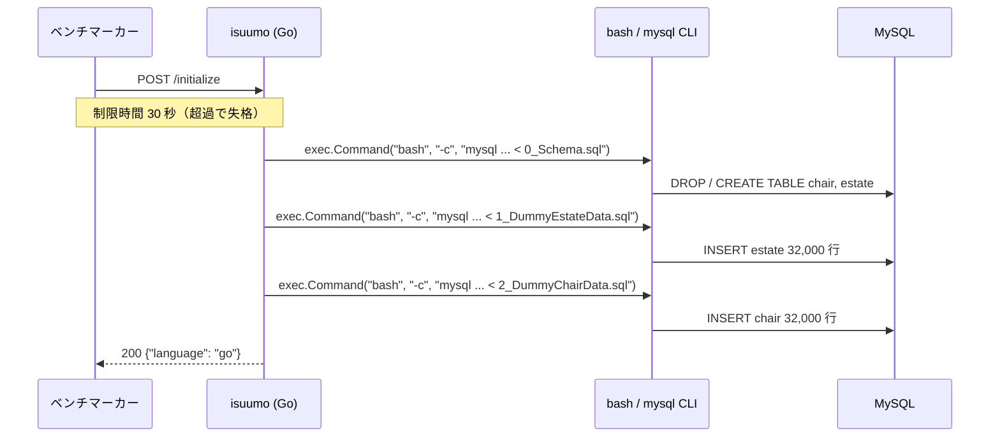

# ISUCON10 予選 (isuumo) アプリ構成マップ(Go)

作成日: 2026-09-05 / 採取元: i1 i2 i3 / 対象コミット: 9079187

> このファイルは `isucon-app-map` スキルの成果物。**構造の記述であって施策の一覧ではない。**
> 「どこが遅いか」は計測結果(alp / pt-query-digest / pprof)を別途この地図に重ねて読む。

## 0. 前提

| 項目 | 値 | 出典 |
|---|---|---|
| アプリ名 | isuumo | `docs/kickoff.md` |
| webapp のパス | `/home/isucon/isuumo/webapp` | |
| Go のディレクトリ / エントリポイント | `go/` / `go/main.go`(979行) | |
| Go のバージョン | 1.14(`go.mod`)。**`go` コマンドは非ログインシェルの PATH に無い** | `app-map-raw/i1.md` |
| Web フレームワーク | echo v3.3.10 | `go/go.mod` |
| DB ドライバ | sqlx v1.2.0 + go-sql-driver/mysql v1.5.0 | `go/go.mod` |
| systemd ユニット(active) | `isuumo.go.service`(3台とも enabled / active) | `systemctl is-active` |
| DB の種類とバージョン | MySQL 5.7.42-0ubuntu0.18.04.1 | `app-map-raw/i1.md` |
| 初期化エンドポイント | `POST /initialize`(`go/main.go:252` → `go/main.go:287`) | |
| 制限時間(初期化) | 30 秒(超過で失格) | マニュアル |
| pprof | **未組み込み**(`net/http/pprof` の import 無し、`:6060` の LISTEN 無し) | `go/main.go` / `app-map-raw/*.md` |

## 1. サマリ

- **3台構成だが働いているのは i1 だけ。** i2 / i3 でも nginx・isuumo・mysqld が動いて LISTEN しているが、CPU 使用率上位に一切現れず、トラフィックが来ていない。
- **インデックスが主キーしか無い。** `chair` / `estate` とも 32,000 行で、検索系のすべての `WHERE`・`ORDER BY` 列(`price` / `height` / `width` / `depth` / `kind` / `color` / `stock` / `popularity` / `rent` / `door_width` / `door_height` / `latitude` / `longitude`)が未インデックス。
- **`POST /api/estate/nazotte` に上限なしの N+1。** バウンディングボックス内の物件を `LIMIT` 無しで全件取り、1件ずつ `ST_Contains` を投げている(`go/main.go:878-894`)。

## 2. 稼働プロセス構成

### 台ごとの稼働プロセス

| ホスト | 役割 | CPU | メモリ | 動いているプロセス | LISTEN | 起動元ユニット | 備考 |
|---|---|---:|---:|---|---|---|---|
| i1 | nginx + app + DB | 2 コア | 3.8G | mysqld(125% CPU) / isuumo(12.5%) / nginx worker ×2 | 80, 1323, 3306 | mysql / isuumo.go / nginx | **唯一トラフィックが来ている台** |
| i2 | 遊休 | 2 コア | 3.8G | mysqld / isuumo / nginx worker ×2 | 80, 1323, 3306 | 同上 | **CPU 上位に一切現れない** |
| i3 | 遊休 | 2 コア | 3.8G | mysqld / isuumo / nginx worker ×2 | 80, 1323, 3306 | 同上 | 同上 |

**「動いている」と「使われている」は別物。** 3台とも同じ構成で全プロセスが起動しているが、i2 / i3 には負荷が来ていない(`app-map-raw/i2.md` / `i3.md` の「CPU 使用率の上位プロセス」に mysqld も isuumo も出てこない)。

台ごとの差異は、ホスト名・IP・PID 以外に無し(`nginx -T` は3台とも md5 一致、MySQL 稼働値も `general_log_file` のホスト名部分以外は一致)。

| 項目 | i1 | i2 | i3 |
|---|---|---|---|
| OS | Ubuntu 18.04.5 LTS (5.4.0-1045-aws) | 同左 | 同左 |
| nginx | 1.14.0 (Ubuntu) | 同左 | 同左 |
| MySQL | 5.7.42-0ubuntu0.18.04.1 | 同左 | 同左 |
| `isuumo.go.service` | enabled / active | 同左 | 同左 |
| `/etc/nginx` `/etc/mysql` | リポジトリへの symlink | 同左 | 同左 |
| ディスク | 20G 中 8.7G 使用 (45%) | 9.0G (47%) | 9.0G (47%) |

### 想定外のプロセス

| ホスト | プロセス | CPU% | MEM% | 起動元 | 備考 |
|---|---|---:|---:|---|---|
| 全台 | `snapd` / `amazon-ssm-agent` ×2 | 0.0 | 1.0 / 0.9 / 0.5 | snap | AMI 由来。CPU は食っていない |
| 全台 | `systemd-journald` | 0.1 | 2.6 | systemd | echo のログ出力先。ログ量が増えるとここに乗る |
| 全台 | 他言語のユニット7つ(deno / nodejs / perl / php / python / ruby / rust) | — | — | — | **すべて disabled / inactive**。プロセスは存在しないので図には描いていない |

**メモリは 3.8G 中 3.1G が available**(i1)。バッファプールに回す余地が大きい。

## 3. リクエストの流れ

- **静的ファイルを返しているのは誰か**: nginx。`location /` が `root /www/data`(`app-map-raw/i1-nginx.conf:156-157`)。**アプリは静的ファイルを返していない。** なおマニュアル上ベンチマーカーは静的ファイルにリクエストしない。
- **`proxy_pass` の向き先**: `location /api` と `location /initialize` がどちらも `http://localhost:1323`(`i1-nginx.conf:148-154`)。`upstream` ブロックは未定義で、単一ホスト直書き。
- **アプリ → DB の接続先**: `127.0.0.1:3306`(`/home/isucon/env.sh` の `MYSQL_HOST`。Go 側デフォルトも同値 `go/main.go:203`)。
- **追加ミドルウェア**: Redis / memcached とも**未導入**(`app-map-raw/*.md` のバージョン一覧に出てこない)。
- **実在しないパスを指している箇所**: `server` 直下の `root /home/isucon/isucon10-qualify/webapp/public;`(`i1-nginx.conf:144`)。**このディレクトリは存在しない**(`ls` で確認済み)。`location /` が自前の `root` を持つため実害は出ていないが、配布時の構成のまま残った死んだ設定。

## 4. エンドポイント一覧

**加点対象**(スコア = イスの購入件数 + 物件の資料請求件数)は `POST /api/chair/buy/:id` と `POST /api/estate/req_doc/:id` の2本。

| メソッド | パス | ハンドラ | 定義行 | 主なクエリ | N+1 | 備考 |
|---|---|---|---|---|---|---|
| POST | `/initialize` | `initialize` | `main.go:252` / 実装 `:287` | `mysql < *.sql` を `exec.Command` で3回 | — | 30秒制限 |
| GET | `/api/chair/:id` | `getChairDetail` | `:255` / `:316` | `SELECT * FROM chair WHERE id = ?`(`:324`) | なし | PK 引き。`stock <= 0` は Go 側で 404 判定(`:333`) |
| POST | `/api/chair` | `postChair` | `:256` / `:341` | tx 内で `INSERT INTO chair` を**1行ずつ**(`:384`) | ループ内 INSERT | **CSV 入稿。失敗・タイムアウトで一発失格** |
| GET | `/api/chair/search` | `searchChairs` | `:257` / `:397` | `SELECT COUNT(*)`(`:511`)+ `SELECT *` に `ORDER BY popularity DESC, id ASC LIMIT ? OFFSET ?`(`:519`) | なし | 条件は動的組み立て。**全条件が未インデックス** |
| GET | `/api/chair/low_priced` | `getLowPricedChair` | `:258` / `:589` | `SELECT * FROM chair WHERE stock > 0 ORDER BY price ASC, id ASC LIMIT 20`(`:591`) | なし | |
| GET | `/api/chair/search/condition` | `getChairSearchCondition` | `:259` / `:585` | **クエリ無し**(`init()` で読んだ JSON をそのまま返す) | — | `fixture/chair_condition.json`(`:226`) |
| POST | `/api/chair/buy/:id` | `buyChair` | `:260` / `:533` | tx: `SELECT * ... FOR UPDATE`(`:560`)→ `UPDATE chair SET stock = stock - 1`(`:570`) | なし | **加点対象** |
| GET | `/api/estate/:id` | `getEstateDetail` | `:263` / `:605` | `SELECT * FROM estate WHERE id = ?`(`:613`) | なし | PK 引き |
| POST | `/api/estate` | `postEstate` | `:264` / `:639` | tx 内で `INSERT INTO estate` を**1行ずつ**(`:681`) | ループ内 INSERT | **CSV 入稿。失敗・タイムアウトで一発失格** |
| GET | `/api/estate/search` | `searchEstates` | `:265` / `:694` | `SELECT COUNT(*)`(`:779`)+ `SELECT *` に `ORDER BY popularity DESC, id ASC LIMIT ? OFFSET ?`(`:787`) | なし | **全条件が未インデックス** |
| GET | `/api/estate/low_priced` | `getLowPricedEstate` | `:266` / `:801` | `SELECT * FROM estate ORDER BY rent ASC, id ASC LIMIT 20`(`:803`) | なし | **`stock` 相当の絞り込み無しで全件ソート** |
| POST | `/api/estate/req_doc/:id` | `postEstateRequestDocument` | `:267` / `:908` | `SELECT * FROM estate WHERE id = ?`(`:928`) | なし | **加点対象。** 存在確認のみで結果は捨てている |
| POST | `/api/estate/nazotte` | `searchEstateNazotte` | `:268` / `:853` | ① BB 内を `LIMIT` 無しで全件(`:867`) ② 各件に `ST_Contains`(`:882`) | **あり（上限なし）** | 素の状態でタイムアウトが数件出る |
| GET | `/api/estate/search/condition` | `getEstateSearchCondition` | `:269` / `:941` | **クエリ無し**(JSON をそのまま返す) | — | `fixture/estate_condition.json`(`:233`) |
| GET | `/api/recommended_estate/:id` | `searchRecommendedEstateWithChair` | `:270` / `:817` | `SELECT * FROM chair WHERE id = ?`(`:825`)→ `estate` を6つの OR 条件で `ORDER BY popularity DESC LIMIT 20`(`:840`) | なし | OR 6条件はインデックスが効きにくい形 |

- 総数: **15 本**(`/initialize` 含む)
- N+1 を含むもの: **1 本**(`searchEstateNazotte`)。ほかにループ内 INSERT が 2 本
- クエリを発行しないもの: 2 本(`*/search/condition`)
- ベンチが叩かないもの: 静的ファイル(マニュアル記載。ただし追試でブラウザ表示を確認される)

## 5. データモデル

| テーブル | 行数 | データ長 | インデックス長 | 主キー | その他のインデックス |
|---|---:|---:|---:|---|---|
| `chair` | 32,000 | 13,840 KB | **0 KB** | `id` (cardinality 29,328) | **なし** |
| `estate` | 32,000 | 14,864 KB | **0 KB** | `id` (cardinality 29,137) | **なし** |

### インデックスが無い検索条件

**インデックス長が両テーブルとも 0 KB** = 主キー以外のインデックスが1本も無い。以下はすべて 32,000 行のフルスキャンになる。

| テーブル | 列 | 使われ方 | 使っているエンドポイント |
|---|---|---|---|
| `chair` | `price` | WHERE(範囲)/ ORDER BY | `/api/chair/search`, `/api/chair/low_priced` |
| `chair` | `height` `width` `depth` | WHERE(範囲) | `/api/chair/search` |
| `chair` | `kind` `color` | WHERE(等価) | `/api/chair/search` |
| `chair` | `stock` | WHERE `stock > 0` | `/api/chair/search`, `/api/chair/low_priced`, `/api/chair/buy/:id` |
| `chair` | `popularity` | ORDER BY | `/api/chair/search` |
| `chair` | `features` | `LIKE CONCAT('%', ?, '%')`(`:481`) | `/api/chair/search` — **前方一致でないためインデックス不可** |
| `estate` | `rent` | WHERE(範囲)/ ORDER BY | `/api/estate/search`, `/api/estate/low_priced` |
| `estate` | `door_height` `door_width` | WHERE(範囲) | `/api/estate/search`, `/api/recommended_estate/:id` |
| `estate` | `latitude` `longitude` | WHERE(範囲) | `/api/estate/nazotte`(`:867`) |
| `estate` | `popularity` | ORDER BY | `/api/estate/search`, `/api/estate/nazotte`, `/api/recommended_estate/:id` |
| `estate` | `features` | `like concat('%', ?, '%')`(`:751`) | `/api/estate/search` — **前方一致でないためインデックス不可** |

### 外部キー

**外部キー制約なし。** `chair` と `estate` は DB 上は無関係で、`/api/recommended_estate/:id` がコード上でイスの寸法から物件を検索しているだけ(`go/main.go:836-841`)。

## 6. 初期化処理

- エンドポイント: `POST /initialize`(ルーティング `go/main.go:252` / 実装 `go/main.go:287`)
- 制限時間: **30 秒**(超過で失格)
- レスポンス形式: `{"language": "go"}`。**`language` が空だとベンチが失敗扱いにする**
- やっていること:
  1. `sqlDir = ../mysql/db`(`:288`)を基点に、`0_Schema.sql` → `1_DummyEstateData.sql` → `2_DummyChairData.sql` の順(`:290-292`)
  2. 各ファイルを `mysql -h ... -u ... -p... -P ... <db> < <file>` の**シェル文字列に組み立て、`exec.Command("bash", "-c", ...)` で実行**(`:296-305`)。Go の DB コネクションは使っていない
  3. `0_Schema.sql` が `DROP TABLE IF EXISTS` → `CREATE TABLE` を行うため、**スキーマは毎回ここで作り直される**
- **変更時に守るべき整合性**:
  - **インデックスを足す場合は `webapp/mysql/db/0_Schema.sql` に書く。** アプリ起動後に `ALTER TABLE` しても、次の `/initialize` で `DROP TABLE` されて消える
  - テーブルを分ける・列を足す場合も同様に `0_Schema.sql` と、対応するデータ投入 SQL の両方を直す
  - `WorkingDirectory=/home/isucon/isuumo/webapp/go`(systemd ユニット)を基点に `../mysql/db` を解決しているので、**バイナリの実行ディレクトリを変えると初期化が壊れる**
- **初期化が消さないもの**:
  - `init()`(`go/main.go:225-239`)で読む `../fixture/chair_condition.json` / `estate_condition.json` — **プロセス起動時に1度だけ読み、`/initialize` では再読み込みされない**。グローバル変数 `chairSearchCondition` / `estateSearchCondition`(`:28-29`)に載る
  - 今後アプリ側にキャッシュを持つ場合、**`/initialize` でクリアしないとベンチ2回目以降に不整合になる**

## 7. 設定の現状

**稼働値。設定ファイルの記述ではない。**

### nginx(`app-map-raw/i1-nginx.conf`、3台とも md5 一致)

| 項目 | 現在値 | 備考 |
|---|---|---|
| `worker_processes` | `auto`(= 2、CPU コア数) | `:3` |
| `worker_connections` | `1024` | `:10` |
| `gzip` | **コメントアウト(無効)** | `:46` `#gzip on;` |
| `keepalive`(upstream) | **upstream ブロック自体が無い** | `proxy_pass` に直書き |
| `keepalive_timeout` | `65` | `:44`(クライアント側) |
| `access_log` の形式 | **LTSV**(`ltsv` 定義は `:23`、適用は `:39`) | キックオフ済み。alp で集計可能 |
| ログサイズ | `/var/log/nginx` 5.9M | |

### MySQL(`app-map-raw/db-schema.md` / `i1-mysql.txt`)

| 項目 | 現在値 | 備考 |
|---|---|---|
| `innodb_buffer_pool_size` | **134217728 (128MB)** | 既定値のまま。**実メモリ 3.8G / available 3.1G に対して極端に小さい** |
| `innodb_buffer_pool_instances` | 1 | |
| `innodb_flush_log_at_trx_commit` | **1** | 永続化は失格条件なのでレギュレーション確認のうえで判断 |
| `innodb_log_file_size` | 50331648 (48MB) | |
| `innodb_io_capacity` | 200 | |
| `max_connections` | 151 | アプリ側は 10 しか開かない(下記) |
| `table_open_cache` | 2000 | |
| `tmp_table_size` / `max_heap_table_size` | 16MB / 16MB | |
| `query_cache_size` / `query_cache_type` | 16MB / **OFF** | サイズは確保されているが type が OFF |
| `slow_query_log` | **ON** | キックオフの `make mrestart` 済み |
| `long_query_time` | **0.000000** | 全クエリ記録。**ログサイズ `/var/log/mysql` が既に 104M** |
| `bind_address` | **127.0.0.1** | 他の台からは接続できない |
| `log_bin` / `sync_binlog` | OFF / 1 | バイナリログ無効 |

**接続元の許可**: `mysql.user` は `isucon@localhost` など**すべて `localhost` のみ**。DB を分離するには `bind_address` と権限の両方を変える必要がある。

### Go アプリ(`go/main.go`)

| 項目 | 現在値 | 場所 |
|---|---|---|
| `SetMaxOpenConns` | **10** | `go/main.go:279` |
| `SetMaxIdleConns` | **未設定**(既定 2) | — |
| `SetConnMaxLifetime` | **未設定** | — |
| デバッグフラグ | **`e.Debug = true`** | `go/main.go:244` |
| ログレベル | **`log.DEBUG`** | `go/main.go:245` |
| ログミドルウェア | **`middleware.Logger()` 有効** | `go/main.go:248` |
| `middleware.Recover()` | 有効 | `go/main.go:249` |
| `http.Server` のタイムアウト | **未設定**(`e.Start(":1323")`) | `go/main.go:283` |
| 待受ポート | `SERVER_PORT` 環境変数、既定 `1323` | `go/main.go:282` |
| pprof | **未組み込み** | — |

## 8. 外部依存 / 複数台構成の障害

- **外部 API / モック**: **なし。** 外部通信を行うコードは無い(`http.Client` の生成も無し)
- **ファイル保存先**: なし。画像は `thumbnail varchar(128)` にパス文字列を持つだけで、バイナリは DB にもアプリにも無い
- **プロセスメモリに持っている状態**:
  - `chairSearchCondition` / `estateSearchCondition`(`go/main.go:28-29`)— `init()` で JSON から読む読み取り専用データ。**全台で同じ内容なので複数台化の障害にはならない**
  - それ以外のキャッシュ・カウンタ・セッションは**なし**
- **アプリ内での ID 採番**: なし。`id` は CSV / 初期データで与えられる
- **cron / タイマー**: `isucon` の crontab なし。`/etc/cron.d` は `mdadm` / `popularity-contest`(OS 由来)

**複数台構成の障害は実質的に `bind_address = 127.0.0.1` と `mysql.user` の `localhost` 限定のみ。** アプリ側は状態を持たないので水平展開しやすい。

## 9. 触ってはいけない範囲

マニュアルとレギュレーション(`docs/kickoff.md` の特記事項)より。

- **`POST /initialize` が 30 秒以内に返らないと失格**
- **アプリケーション互換性チェック(10秒以内)の失敗で失格**
- **データが永続化されていない**(ベンチ後の再起動で内容が失われる)と失格 — `innodb_flush_log_at_trx_commit` を触るときの制約
- **ブラウザ上の表示が初期状態と変わっている**と失格 — 静的ファイル配信(`location / { root /www/data; }`)を壊さないこと
- **`isucon` 以外のアカウント削除や既存公開鍵の削除**は追試不能で失格
- **CSV 入稿(`POST /api/chair` / `POST /api/estate`)の失敗・タイムアウトは `(critical error)` で一発失格**
- HTTP ステータスコードやレスポンス内容の誤りは 1 回 50 点減点、**10 回以上で失格**
- スコア = イスの購入件数 + 物件の資料請求件数 − 減点。**加点は `POST /api/chair/buy/:id` と `POST /api/estate/req_doc/:id` の2本のみ**

## 10. 目についた伸びしろ

**事実の列挙。優先順位はつけない。** 施策の決定は計測結果(alp / pt-query-digest / pprof)と突き合わせてから。

- **i2 / i3 にトラフィックが来ていない。** 3台とも nginx・isuumo・mysqld が起動して LISTEN しているが、CPU 上位に現れるのは i1 のみ(`app-map-raw/i2.md` / `i3.md`)。CPU 2コア × 3台のうち 2/3 が遊んでいる
- **主キー以外のインデックスが1本も無い。** 両テーブルともインデックス長 0 KB で、検索系の全条件が 32,000 行フルスキャン(`app-map-raw/db-schema.md`)
- **`innodb_buffer_pool_size` が既定の 128MB。** i1 の available メモリは 3.1G(`app-map-raw/i1.md`)
- **`POST /api/estate/nazotte` の N+1 に上限が無い。** BB 内の物件を `LIMIT` 無しで取得(`go/main.go:867`)し、1件ずつ `ST_Contains` を発行(`go/main.go:878-894`)。しかも②のクエリは `fmt.Sprintf` でポリゴン文字列を毎回埋め込んでいる(`go/main.go:882`)ためプリペアドが再利用されない
- **`db.SetMaxOpenConns(10)`**(`go/main.go:279`)。MySQL 側は `max_connections = 151`。`SetMaxIdleConns` は未設定で既定 2 のため、接続の張り直しが起きる
- **`e.Debug = true` / `log.DEBUG` / `middleware.Logger()` が全部有効**(`go/main.go:244-248`)。全リクエストが journald に書かれる
- **全ハンドラが `SELECT *`。** `description varchar(4096)` を毎回転送している(`go/main.go:324` ほか)
- **`features` の絞り込みが `LIKE CONCAT('%', ?, '%')`**(`go/main.go:481` / `:751`)。前方一致でないためインデックス不可
- **CSV 入稿がループ内 1 行ずつ INSERT**(`go/main.go:384` / `:681`)。**失敗・タイムアウトで一発失格**の経路
- **`gzip` が無効**(`i1-nginx.conf:46`)。`upstream` ブロックが無く `keepalive` も未設定
- **`long_query_time = 0` でスロークエリログが 104M**。計測には必要だが、最終ベンチ前に戻す必要がある
- **pprof が未組み込み。** チーム標準 Makefile の `make pprof` は `:6060` を叩く前提なので、現状は使えない
- **nginx の `server` 直下 `root` が実在しないパス**(`i1-nginx.conf:144`)。実害は無いが死んだ設定
- **`getLowPricedEstate` が全件を `ORDER BY rent` している**(`go/main.go:803`)。`chair` 側は `stock > 0` で絞るが `estate` 側は絞り込み条件なし

## 未確認

- **レギュレーション本文**(http://isucon.net/archives/54753430.html)は未取得。`docs/kickoff.md` の時点から変わらず未確認。マニュアルと矛盾する場合はマニュアルが優先
- **`go` コマンドが非ログインシェルの PATH に無い**(`app-map-raw/i1.md`)。ビルドはローカルで行い `make upload` で配るチーム標準の運用なので実害は無いが、サーバー上で `go build` する場合はフルパスが要る
- 採取時点で mysqld の CPU が 125%(i1)。採取の 2 分前(04:46)に mysqld と isuumo が起動しており、**直前に誰かが `make re` 相当を実行した直後の状態**と思われる。定常状態の値ではない
- `app-map-raw/*.err` は SSH の post-quantum 警告のみで、採取の失敗は無し
