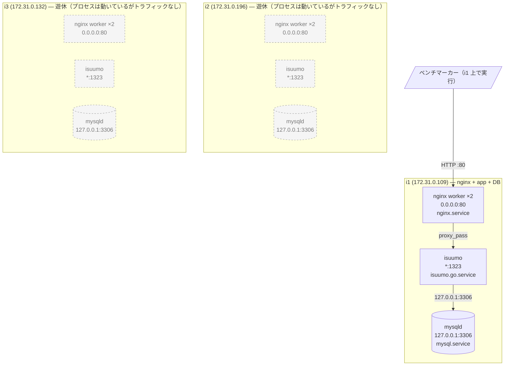

## 2. 稼働プロセス構成

### 台ごとの稼働プロセス

| ホスト | 役割 | CPU | メモリ | 動いているプロセス | LISTEN | 起動元ユニット | 備考 |
|---|---|---:|---:|---|---|---|---|
| i1 | nginx + app + DB | 2 コア | 3.8G | mysqld(125% CPU) / isuumo(12.5%) / nginx worker ×2 | 80, 1323, 3306 | mysql / isuumo.go / nginx | **唯一トラフィックが来ている台** |
| i2 | 遊休 | 2 コア | 3.8G | mysqld / isuumo / nginx worker ×2 | 80, 1323, 3306 | 同上 | **CPU 上位に一切現れない** |
| i3 | 遊休 | 2 コア | 3.8G | mysqld / isuumo / nginx worker ×2 | 80, 1323, 3306 | 同上 | 同上 |

**「動いている」と「使われている」は別物。** 3台とも同じ構成で全プロセスが起動しているが、i2 / i3 には負荷が来ていない(`app-map-raw/i2.md` / `i3.md` の「CPU 使用率の上位プロセス」に mysqld も isuumo も出てこない)。

台ごとの差異は、ホスト名・IP・PID 以外に無し(`nginx -T` は3台とも md5 一致、MySQL 稼働値も `general_log_file` のホスト名部分以外は一致)。

| 項目 | i1 | i2 | i3 |
|---|---|---|---|
| OS | Ubuntu 18.04.5 LTS (5.4.0-1045-aws) | 同左 | 同左 |
| nginx | 1.14.0 (Ubuntu) | 同左 | 同左 |
| MySQL | 5.7.42-0ubuntu0.18.04.1 | 同左 | 同左 |
| `isuumo.go.service` | enabled / active | 同左 | 同左 |
| `/etc/nginx` `/etc/mysql` | リポジトリへの symlink | 同左 | 同左 |
| ディスク | 20G 中 8.7G 使用 (45%) | 9.0G (47%) | 9.0G (47%) |

### 想定外のプロセス

| ホスト | プロセス | CPU% | MEM% | 起動元 | 備考 |
|---|---|---:|---:|---|---|
| 全台 | `snapd` / `amazon-ssm-agent` ×2 | 0.0 | 1.0 / 0.9 / 0.5 | snap | AMI 由来。CPU は食っていない |
| 全台 | `systemd-journald` | 0.1 | 2.6 | systemd | echo のログ出力先。ログ量が増えるとここに乗る |
| 全台 | 他言語のユニット7つ(deno / nodejs / perl / php / python / ruby / rust) | — | — | — | **すべて disabled / inactive**。プロセスは存在しないので図には描いていない |

**メモリは 3.8G 中 3.1G が available**(i1)。バッファプールに回す余地が大きい。

---

[← 索引に戻る](README.md) ｜ [次: リクエストの流れ →](03-request-flow.md)
