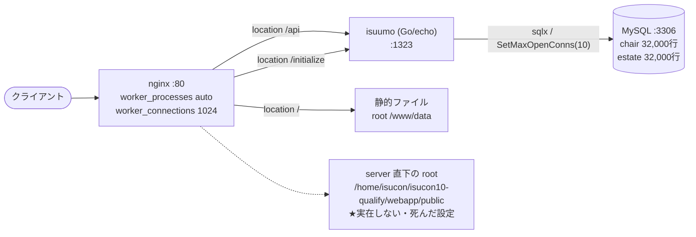

## 3. リクエストの流れ

- **静的ファイルを返しているのは誰か**: nginx。`location /` が `root /www/data`(`app-map-raw/i1-nginx.conf:156-157`)。**アプリは静的ファイルを返していない。** なおマニュアル上ベンチマーカーは静的ファイルにリクエストしない。
- **`proxy_pass` の向き先**: `location /api` と `location /initialize` がどちらも `http://localhost:1323`(`i1-nginx.conf:148-154`)。`upstream` ブロックは未定義で、単一ホスト直書き。
- **アプリ → DB の接続先**: `127.0.0.1:3306`(`/home/isucon/env.sh` の `MYSQL_HOST`。Go 側デフォルトも同値 `go/main.go:203`)。
- **追加ミドルウェア**: Redis / memcached とも**未導入**(`app-map-raw/*.md` のバージョン一覧に出てこない)。
- **実在しないパスを指している箇所**: `server` 直下の `root /home/isucon/isucon10-qualify/webapp/public;`(`i1-nginx.conf:144`)。**このディレクトリは存在しない**(`ls` で確認済み)。`location /` が自前の `root` を持つため実害は出ていないが、配布時の構成のまま残った死んだ設定。

---

[← 索引に戻る](README.md) ｜ [次: エンドポイント一覧 →](04-endpoints.md)
