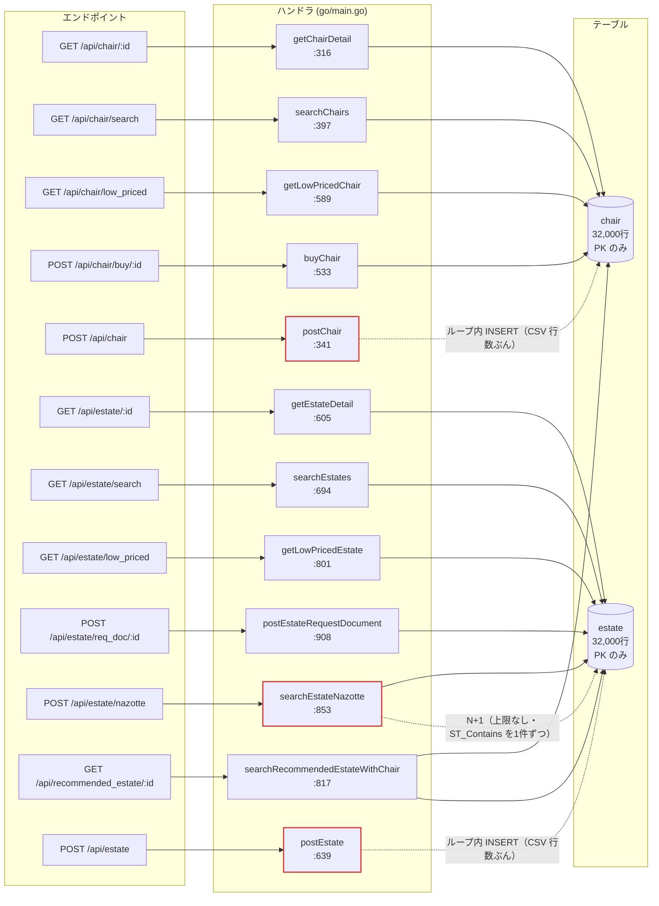

## 4. エンドポイント一覧

**加点対象**(スコア = イスの購入件数 + 物件の資料請求件数)は `POST /api/chair/buy/:id` と `POST /api/estate/req_doc/:id` の2本。

| メソッド | パス | ハンドラ | 定義行 | 主なクエリ | N+1 | 備考 |
|---|---|---|---|---|---|---|
| POST | `/initialize` | `initialize` | `main.go:252` / 実装 `:287` | `mysql < *.sql` を `exec.Command` で3回 | — | 30秒制限 |
| GET | `/api/chair/:id` | `getChairDetail` | `:255` / `:316` | `SELECT * FROM chair WHERE id = ?`(`:324`) | なし | PK 引き。`stock <= 0` は Go 側で 404 判定(`:333`) |
| POST | `/api/chair` | `postChair` | `:256` / `:341` | tx 内で `INSERT INTO chair` を**1行ずつ**(`:384`) | ループ内 INSERT | **CSV 入稿。失敗・タイムアウトで一発失格** |
| GET | `/api/chair/search` | `searchChairs` | `:257` / `:397` | `SELECT COUNT(*)`(`:511`)+ `SELECT *` に `ORDER BY popularity DESC, id ASC LIMIT ? OFFSET ?`(`:519`) | なし | 条件は動的組み立て。**全条件が未インデックス** |
| GET | `/api/chair/low_priced` | `getLowPricedChair` | `:258` / `:589` | `SELECT * FROM chair WHERE stock > 0 ORDER BY price ASC, id ASC LIMIT 20`(`:591`) | なし | |
| GET | `/api/chair/search/condition` | `getChairSearchCondition` | `:259` / `:585` | **クエリ無し**(`init()` で読んだ JSON をそのまま返す) | — | `fixture/chair_condition.json`(`:226`) |
| POST | `/api/chair/buy/:id` | `buyChair` | `:260` / `:533` | tx: `SELECT * ... FOR UPDATE`(`:560`)→ `UPDATE chair SET stock = stock - 1`(`:570`) | なし | **加点対象** |
| GET | `/api/estate/:id` | `getEstateDetail` | `:263` / `:605` | `SELECT * FROM estate WHERE id = ?`(`:613`) | なし | PK 引き |
| POST | `/api/estate` | `postEstate` | `:264` / `:639` | tx 内で `INSERT INTO estate` を**1行ずつ**(`:681`) | ループ内 INSERT | **CSV 入稿。失敗・タイムアウトで一発失格** |
| GET | `/api/estate/search` | `searchEstates` | `:265` / `:694` | `SELECT COUNT(*)`(`:779`)+ `SELECT *` に `ORDER BY popularity DESC, id ASC LIMIT ? OFFSET ?`(`:787`) | なし | **全条件が未インデックス** |
| GET | `/api/estate/low_priced` | `getLowPricedEstate` | `:266` / `:801` | `SELECT * FROM estate ORDER BY rent ASC, id ASC LIMIT 20`(`:803`) | なし | **`stock` 相当の絞り込み無しで全件ソート** |
| POST | `/api/estate/req_doc/:id` | `postEstateRequestDocument` | `:267` / `:908` | `SELECT * FROM estate WHERE id = ?`(`:928`) | なし | **加点対象。** 存在確認のみで結果は捨てている |
| POST | `/api/estate/nazotte` | `searchEstateNazotte` | `:268` / `:853` | ① BB 内を `LIMIT` 無しで全件(`:867`) ② 各件に `ST_Contains`(`:882`) | **あり（上限なし）** | 素の状態でタイムアウトが数件出る |
| GET | `/api/estate/search/condition` | `getEstateSearchCondition` | `:269` / `:941` | **クエリ無し**(JSON をそのまま返す) | — | `fixture/estate_condition.json`(`:233`) |
| GET | `/api/recommended_estate/:id` | `searchRecommendedEstateWithChair` | `:270` / `:817` | `SELECT * FROM chair WHERE id = ?`(`:825`)→ `estate` を6つの OR 条件で `ORDER BY popularity DESC LIMIT 20`(`:840`) | なし | OR 6条件はインデックスが効きにくい形 |

- 総数: **15 本**(`/initialize` 含む)
- N+1 を含むもの: **1 本**(`searchEstateNazotte`)。ほかにループ内 INSERT が 2 本
- クエリを発行しないもの: 2 本(`*/search/condition`)
- ベンチが叩かないもの: 静的ファイル(マニュアル記載。ただし追試でブラウザ表示を確認される)

---

[← 索引に戻る](README.md) ｜ [次: データモデル →](05-schema.md)
