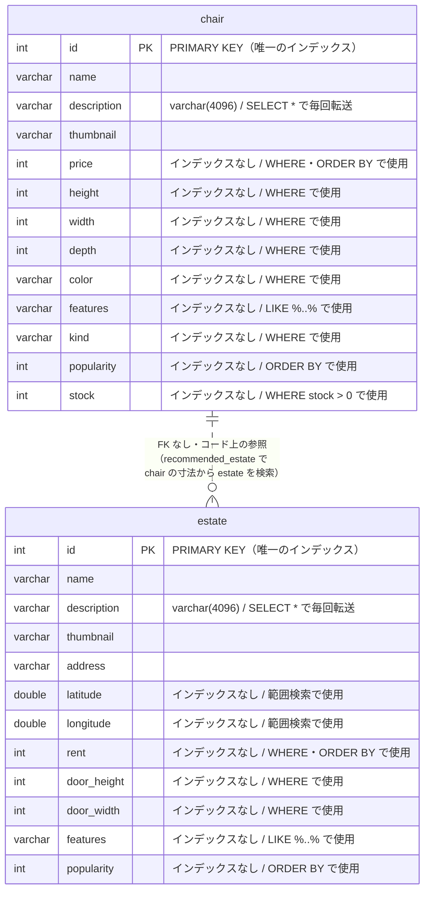

## 5. データモデル

| テーブル | 行数 | データ長 | インデックス長 | 主キー | その他のインデックス |
|---|---:|---:|---:|---|---|
| `chair` | 32,000 | 13,840 KB | **0 KB** | `id` (cardinality 29,328) | **なし** |
| `estate` | 32,000 | 14,864 KB | **0 KB** | `id` (cardinality 29,137) | **なし** |

### インデックスが無い検索条件

**インデックス長が両テーブルとも 0 KB** = 主キー以外のインデックスが1本も無い。以下はすべて 32,000 行のフルスキャンになる。

| テーブル | 列 | 使われ方 | 使っているエンドポイント |
|---|---|---|---|
| `chair` | `price` | WHERE(範囲)/ ORDER BY | `/api/chair/search`, `/api/chair/low_priced` |
| `chair` | `height` `width` `depth` | WHERE(範囲) | `/api/chair/search` |
| `chair` | `kind` `color` | WHERE(等価) | `/api/chair/search` |
| `chair` | `stock` | WHERE `stock > 0` | `/api/chair/search`, `/api/chair/low_priced`, `/api/chair/buy/:id` |
| `chair` | `popularity` | ORDER BY | `/api/chair/search` |
| `chair` | `features` | `LIKE CONCAT('%', ?, '%')`(`:481`) | `/api/chair/search` — **前方一致でないためインデックス不可** |
| `estate` | `rent` | WHERE(範囲)/ ORDER BY | `/api/estate/search`, `/api/estate/low_priced` |
| `estate` | `door_height` `door_width` | WHERE(範囲) | `/api/estate/search`, `/api/recommended_estate/:id` |
| `estate` | `latitude` `longitude` | WHERE(範囲) | `/api/estate/nazotte`(`:867`) |
| `estate` | `popularity` | ORDER BY | `/api/estate/search`, `/api/estate/nazotte`, `/api/recommended_estate/:id` |
| `estate` | `features` | `like concat('%', ?, '%')`(`:751`) | `/api/estate/search` — **前方一致でないためインデックス不可** |

### 外部キー

**外部キー制約なし。** `chair` と `estate` は DB 上は無関係で、`/api/recommended_estate/:id` がコード上でイスの寸法から物件を検索しているだけ(`go/main.go:836-841`)。

---

[← 索引に戻る](README.md) ｜ [次: 初期化処理 →](06-initialize.md)
