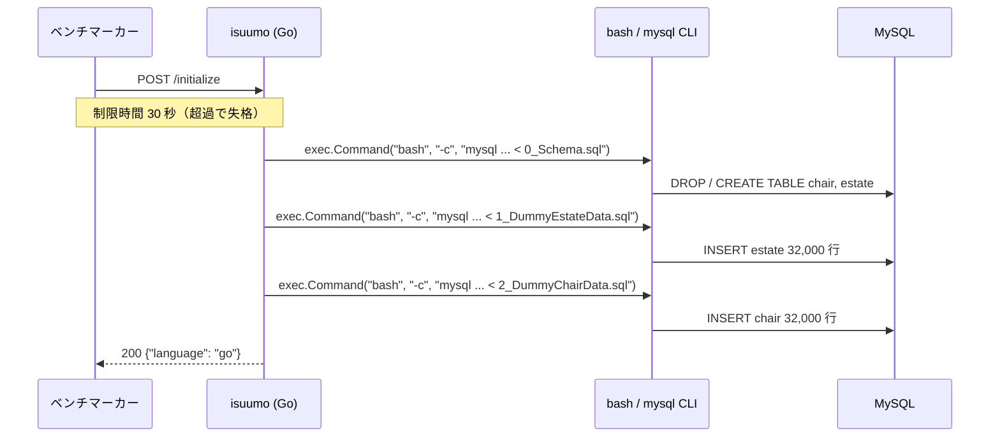

## 6. 初期化処理

- エンドポイント: `POST /initialize`(ルーティング `go/main.go:252` / 実装 `go/main.go:287`)
- 制限時間: **30 秒**(超過で失格)
- レスポンス形式: `{"language": "go"}`。**`language` が空だとベンチが失敗扱いにする**
- やっていること:
  1. `sqlDir = ../mysql/db`(`:288`)を基点に、`0_Schema.sql` → `1_DummyEstateData.sql` → `2_DummyChairData.sql` の順(`:290-292`)
  2. 各ファイルを `mysql -h ... -u ... -p... -P ... <db> < <file>` の**シェル文字列に組み立て、`exec.Command("bash", "-c", ...)` で実行**(`:296-305`)。Go の DB コネクションは使っていない
  3. `0_Schema.sql` が `DROP TABLE IF EXISTS` → `CREATE TABLE` を行うため、**スキーマは毎回ここで作り直される**
- **変更時に守るべき整合性**:
  - **インデックスを足す場合は `webapp/mysql/db/0_Schema.sql` に書く。** アプリ起動後に `ALTER TABLE` しても、次の `/initialize` で `DROP TABLE` されて消える
  - テーブルを分ける・列を足す場合も同様に `0_Schema.sql` と、対応するデータ投入 SQL の両方を直す
  - `WorkingDirectory=/home/isucon/isuumo/webapp/go`(systemd ユニット)を基点に `../mysql/db` を解決しているので、**バイナリの実行ディレクトリを変えると初期化が壊れる**
- **初期化が消さないもの**:
  - `init()`(`go/main.go:225-239`)で読む `../fixture/chair_condition.json` / `estate_condition.json` — **プロセス起動時に1度だけ読み、`/initialize` では再読み込みされない**。グローバル変数 `chairSearchCondition` / `estateSearchCondition`(`:28-29`)に載る
  - 今後アプリ側にキャッシュを持つ場合、**`/initialize` でクリアしないとベンチ2回目以降に不整合になる**

---

[← 索引に戻る](README.md) ｜ [次: 設定の現状 →](07-settings.md)
