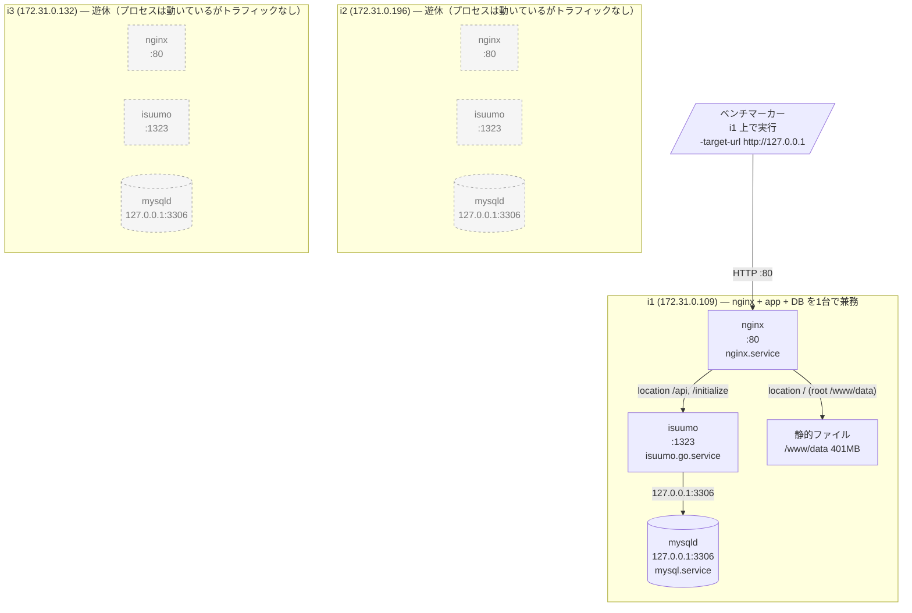
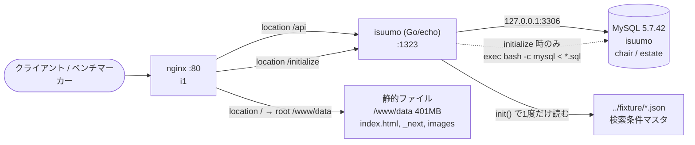
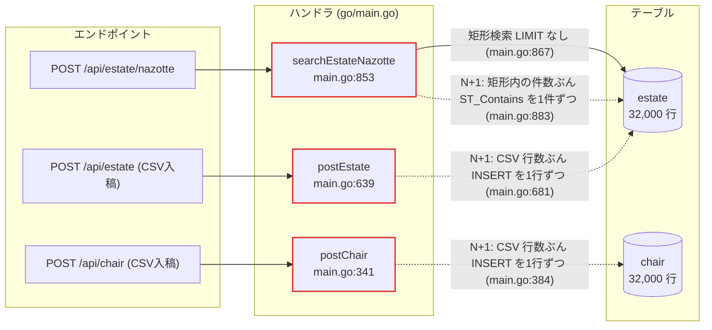
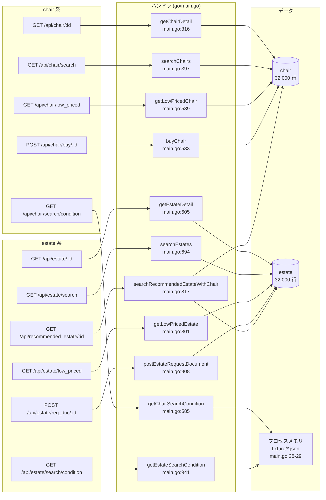
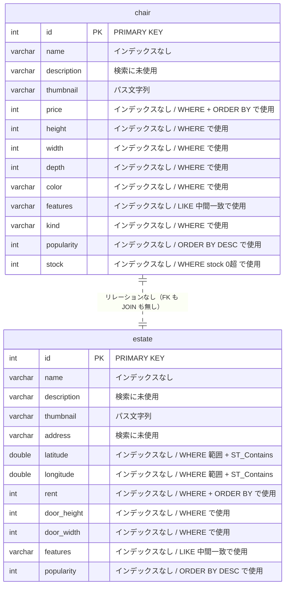
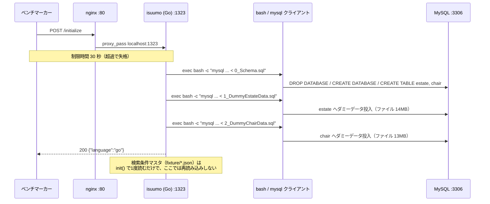

# ISUCON10 予選（isuumo）アプリ構成マップ（Go）

作成日: 2026-09-05 / 採取元: `i1 i2 i3` / 対象コミット: `2a89c7b`(**本文の `ファイル:行` はすべてこのコミットの内容に対する行番号。** HEAD が進むと食い違うので、照合は `git show 2a89c7b:go/main.go` で行う)

> `isucon-app-map` スキルの成果物。**作成時点のスナップショットで、以後は更新しない。**
> 現在のサーバー構成は [`docs/servers.md`](../servers.md)、改善の進捗は Issue / PR を見る。
> **構造の記述であって施策の一覧ではない**（章11 だけが例外で、計測前の仮説として候補を書く）。
> 「どこが遅いか」は計測結果（alp / pt-query-digest / pprof）を別途この地図に重ねて読む。
> 生ログは `app-map-raw/`（`.gitignore` 済み・commit しない）。

## 目次

| 章 | 内容 | 図 |
|---|---|---|
| [0. 前提](#0-前提) | 大会ごとに変わる値の置き場 | — |
| [1. サマリ](#1-サマリ) | 3行。今の構成 / 遊んでいるリソース / 目立つ構造上の問題 | — |
| [2. 稼働プロセス構成](#2-稼働プロセス構成) | 台ごとに何が動いていて、どこにトラフィックが来ているか | `flowchart` |
| [3. リクエストの流れ](#3-リクエストの流れ) | nginx の location から アプリ / 静的ファイル / DB まで | `flowchart` |
| [4. エンドポイント一覧](#4-エンドポイント一覧) | メソッド / パス / ハンドラ / クエリ / N+1 / US | `flowchart` ×2 |
| [5. データモデル](#5-データモデル) | テーブル / 行数 / インデックス / 欠落している検索条件 | `erDiagram` |
| [6. 初期化処理](#6-初期化処理) | 何を再現しているか、変更時に守るべき整合性 | `sequenceDiagram` |
| [7. 設定の現状](#7-設定の現状) | nginx / DB / Go アプリの**稼働値** | — |
| [8. 外部依存 / 複数台構成の障害](#8-外部依存--複数台構成の障害) | 外部 API / ファイル / プロセスメモリの状態 | — |
| [9. 触ってはいけない範囲](#9-触ってはいけない範囲) | レギュレーション由来の失格条件 | — |
| [10. 目についた伸びしろ](#10-目についた伸びしろ) | 事実の列挙。優先順位はつけない | — |
| [11. 改善候補](#11-改善候補) | **計測前の仮説**。キャッシュ / インデックス / スキーマ / クエリ書き換え / 構成と設定、最初に手を入れる順、見送ったもの | — |
| [未確認](#未確認) | 採れなかった情報、読めなかった箇所 | — |

## 0. 前提

| 項目 | 値 | 出典 |
|---|---|---|
| アプリ名 | ISUUMO（`isuumo`） | `docs/kickoff.md` |
| webapp のパス | `/home/isucon/isuumo/webapp`（リポジトリルートは `/home/isucon/isuumo`） | `docs/kickoff.md` |
| Go のディレクトリ / エントリポイント | `/home/isucon/isuumo/webapp/go` / `go/main.go`（979 行、単一ファイル） | `isuumo.go.service` |
| Go のバージョン | **未確認**（3 台とも `go` が PATH に無い）。`docs/kickoff.md` の記載は 1.14.7、`go.mod:3` は `go 1.14` | `app-map-raw/i{1,2,3}.md` |
| Web フレームワーク | **echo v3**（`v3.3.10+incompatible`） | `go/go.mod:10`、`go/main.go:243` |
| DB ドライバ | **sqlx v1.2.0** + `go-sql-driver/mysql v1.5.0` | `go/go.mod:8-9` |
| systemd ユニット名（active） | `isuumo.go.service`（3 台とも enabled / active。他言語ユニットは全台 disabled / inactive） | `systemctl is-active` |
| DB の種類とバージョン | MySQL 5.7.42-0ubuntu0.18.04.1、DB 名 `isuumo` | `app-map-raw/db-schema.md` |
| 初期化エンドポイント | `POST /initialize`（`go/main.go:252`、実装 `:287`） | |
| 制限時間（初期化） | **30 秒**（超過で失格） | `docs/isucon10_qualify_manual.md` |
| pprof | **未組み込み**（`net/http/pprof` の import なし、3 台とも `:6060` 未 LISTEN） | `go/main.go:3-21`、`app-map-raw/i{1,2,3}.md` |
| US レポート | **あり**（`docs/us/report.md`、US-01〜US-06） | 章4 の US 列と章11 の材料 |

## 1. サマリ

- **3 台すべてで nginx + `isuumo`(:1323) + MySQL が同一構成で稼働しているが、トラフィックが入るのは i1 のみ。i2 / i3 は 1 リクエストも受けていない完全な遊休。** MySQL は 3 台とも `bind_address = 127.0.0.1` で他台から繋げず、権限も `isucon@localhost` のみ。
- **`chair` / `estate` の 2 テーブル・各 32,000 行に対し、セカンダリインデックスが 1 本も存在しない（インデックス長 0 KB）。** `id` 以外のすべての検索・整列（`popularity` / `price` / `rent` / `stock` / `door_*` / `latitude` / `longitude` / `features` の LIKE 中間一致）がフルスキャン + filesort になる。
- **構造上の目立った問題は 3 つ**: `POST /api/estate/nazotte` が LIMIT なしの矩形検索 + 1 件ずつの `ST_Contains`（`go/main.go:867`, `:883`）、Go アプリが `e.Debug = true` かつ `middleware.Logger()` 有効で全リクエストをログ出力（`:244-248`）、`SetMaxOpenConns(10)` に対し `SetMaxIdleConns` 未設定（既定 2、`:279`）。アプリはステートレスで ID 採番も無く、**水平分割の障害は「DB の bind_address」「initialize の SQL 相対パス」「静的画像 401MB の配置」の 3 点だけ。**

## 2. 稼働プロセス構成

**作成時点の構成。現在の構成は [`docs/servers.md`](../servers.md) が正。**



### 台ごとの稼働プロセス

| ホスト | 役割 | CPU | メモリ | 動いているプロセス | LISTEN | 起動元ユニット | 備考 |
|---|---|---:|---:|---|---|---|---|
| i1 | nginx + app + db（全負荷） | 2 コア | 3.8 GB（used 383M / buff-cache 2.7G / Swap 0） | nginx（master + worker）, isuumo, mysqld, sshd, snapd, amazon-ssm-agent | `0.0.0.0:80`, `*:1323`, `127.0.0.1:3306`, `0.0.0.0:22`, `127.0.0.53:53` | `nginx.service` / `isuumo.go.service` / `mysql.service` | ベンチはこの台に対して実行する |
| i2 | **遊休** | 2 コア | 3.8 GB（used 383M / buff-cache 2.5G / Swap 0） | 同上（nginx / isuumo / mysqld すべて稼働） | `0.0.0.0:80`, `*:1323`, `127.0.0.1:3306`, `0.0.0.0:22`, `127.0.0.53:53` | 同上 | プロセスは i1 と同一構成だがトラフィックが来ていない |
| i3 | **遊休** | 2 コア | 3.8 GB（used 378M / buff-cache 2.6G / Swap 0） | 同上（nginx / isuumo / mysqld すべて稼働） | `0.0.0.0:80`, `*:1323`, `127.0.0.1:3306`, `0.0.0.0:22`, `127.0.0.53:53`, `172.31.0.132:68/udp` | 同上 | 同上 |

**「動いている」と「使われている」は別物。** 3 台とも nginx / isuumo / mysqld が `active` で同じポートを LISTEN しているが、`docs/kickoff.md` のベンチ手順が `ssh i1 'cd isuumo/bench && ./bench -target-url http://127.0.0.1'` であるとおり、**負荷が入るのは i1 だけ**。i2 / i3 は起動しているだけで 1 リクエストも受けていない。

**MySQL は 3 台とも `bind_address = 127.0.0.1`** なので、この状態では他の台からの接続を受け付けない（`app-map-raw/i{1,2,3}-mysql.txt`）。DB 権限も `isucon@localhost` のみ（`app-map-raw/db-schema.md`）。

### 想定外のプロセス

| ホスト | プロセス | CPU% | MEM% | 起動元 | 備考 |
|---|---|---:|---:|---|---|
| i1 / i2 / i3 | `snapd` | 0.0 | 数 % | `snapd.service` | AMI 由来。停止中の負荷は無い |
| i1 / i2 / i3 | `amazon-ssm-agent` / `ssm-agent-worker` | 0.0 | 数 % | `amazon-ssm-agent.service` | AWS 練習環境由来。本戦環境には無い |
| i1 | `systemd-journald` | 0.0 | 272 MB | `systemd-journald.service` | i1 でメモリ最大のプロセス。mysqld（225 MB）より大きい |

他言語の参考実装ユニット（`isuumo.deno` / `nodejs` / `perl` / `php` / `python` / `ruby` / `rust`）は**全台で `disabled` かつ `inactive`**。プロセスとして残っているものは無い（`app-map-raw/i{1,2,3}.md`）。採取時点はいずれの台もアイドルで、`ps` の %CPU 上位はすべて 0.0% のカーネルスレッドだった。

### 台ごとの差異

| 項目 | i1 | i2 | i3 |
|---|---|---|---|
| OS | Ubuntu 18.04.5 LTS / 5.4.0-1045-aws | 同左 | 同左 |
| CPU / メモリ | 2 コア Xeon 6975P-C / 3.8 GB | 同左 | 同左 |
| ディスク | 20 GB 中 8.8 GB 使用（46%） | 20 GB 中 9.0 GB 使用（47%） | 20 GB 中 9.0 GB 使用（47%） |
| nginx | 1.14.0（設定は3台完全同一） | 1.14.0（同一） | 1.14.0（同一） |
| MySQL | 5.7.42-0ubuntu0.18.04.1 | 同左 | 同左 |
| Go | ランタイムのバージョンは**未確認**（`go` が PATH に無い）。`docs/kickoff.md` の記載は 1.14.7 | 同左 | 同左 |
| アプリのユニット | `isuumo.go.service` enabled / **active** | 同左 | 同左 |
| `slow_query_log` | **ON** | OFF | OFF |
| `long_query_time` | **0.000000** | 10.000000 | 10.000000 |
| pprof（`:6060`） | 未 LISTEN | 未 LISTEN | 未 LISTEN |

**i1 だけスロークエリログの設定が違う。** `mysql/mysql.conf.d/mysqld.cnf:76-78` では `slow_query_log` はコメントアウトされたままなので、これは設定ファイル由来ではなく **`SET GLOBAL` による実行時設定**。mysqld を再起動すると OFF に戻る。

## 3. リクエストの流れ



- **静的ファイルを返しているのは誰か**: nginx。`location / { root /www/data; }`（`app-map-raw/i1-nginx.conf`）。Go アプリ側に `e.Static` などの静的配信ルートは**無い**（`go/main.go` に該当なし）。`/www/data` は 401MB で、うち `images/chair` 275MB・`images/estate` 126MB。
- **`proxy_pass` の向き先（`location` ごと）**:

  | location | 向き先 | 備考 |
  |---|---|---|
  | `/api` | `http://localhost:1323` | upstream 定義なし・keepalive なし |
  | `/initialize` | `http://localhost:1323` | 同上 |
  | `/` | （proxy せず）`root /www/data` | 静的配信 |

- **アプリ → DB の接続先**: `127.0.0.1:3306`（`go/main.go:201-209` の既定値と `/home/isucon/env.sh` の `MYSQL_HOST=127.0.0.1` が一致）。同一ホスト内で完結している。
- **追加ミドルウェア（Redis / memcached 等）の有無**: **無し**。3 台とも LISTEN しているのは 80 / 1323 / 3306 / 22 / 53 のみ（`app-map-raw/i{1,2,3}.md`）。
- **nginx の設定で実在しないパスや別の場所を指している箇所**:
  - `server` ブロック直下の `root /home/isucon/isucon10-qualify/webapp/public;` は**実在しないパス**（i1 で確認、`No such file or directory`）。`location /` の `root /www/data` に上書きされているため実害は出ていないが、この行だけを見て静的ファイルの場所を判断すると誤る。
  - `sites-enabled/isuumo.conf` は `sites-available/isuumo.conf` への symlink。PHP 用の `isuumo.php.conf` は `sites-available` にあるが有効化されていない。
- **3 台の nginx 設定は完全に同一**（`diff` で差分ゼロ）。
- **アクセスログは LTSV 形式**（`nginx/nginx.conf:22-38`）で `/var/log/nginx/access.log` に出力。alp で集計できる状態。`$request_time` / `$upstream_response_time` を含む。

## 4. エンドポイント一覧

エンドポイントが 15 本あるため、**「N+1 / 全件走査を含むもの」と「それ以外」の 2 枚**に分けている。

### 図1: N+1 / 全件走査を含むエンドポイント



### 図2: その他のエンドポイント



### エンドポイント表

ルーティングは `go/main.go:252-270` に全件ベタ書き。フレームワークは **echo v3**（`go/main.go:243`）。全 15 本ともハンドラを開いて確認済み（未確認なし）。

**US 列**は `docs/us/report.md` の「3. 加点に至るリクエスト列」から埋めた。通過する US ID をカンマ区切りで書き、加点地点は `★US-01` のように `★` を前置している。US レポートの表に現れないエンドポイントは「US 経路に無し」と書いた（US 側の未通過経路は `docs/us/report.md` 章6 にある）。

| メソッド | パス | ハンドラ | 定義行 | 主なクエリ | N+1 | US | 備考 |
|---|---|---|---|---|:--:|---|---|
| POST | `/initialize` | `initialize` | `go/main.go:252`（実装 `:287`） | SQL 発行なし。`exec.Command("bash","-c","mysql … < file")` × 3（`:305`） | — | US 経路に無し（ベンチ専用） | 詳細は[章6](#6-初期化処理) |
| GET | `/api/chair/:id` | `getChairDetail` | `go/main.go:255`（実装 `:316`） | `SELECT * FROM chair WHERE id = ?`（`:324`） | 無 | US-01, US-02, US-05 | 取得後に Go 側で `stock <= 0` を見て 404（`:333`） |
| POST | `/api/chair` | `postChair` | `go/main.go:256`（実装 `:341`） | `INSERT INTO chair …`（`:384`、for 内） | **有** | US 経路に無し（US 側未通過） | CSV 入稿。`csv.ReadAll()` で全行メモリ展開（`:353`）。**失敗すると critical error で一発失格** |
| GET | `/api/chair/search` | `searchChairs` | `go/main.go:257`（実装 `:397`） | `SELECT COUNT(*) …`（`:511`）+ `SELECT * … ORDER BY popularity DESC, id ASC LIMIT ? OFFSET ?`（`:519`） | 無 | US-01 | 条件列: `price` `height` `width` `depth` `kind` `color` `features`(LIKE) `stock`。1リクエストで2クエリ。US-01 は 2 回叩く（1ページ目 + 2ページ目） |
| GET | `/api/chair/low_priced` | `getLowPricedChair` | `go/main.go:258`（実装 `:589`） | `SELECT * FROM chair WHERE stock > 0 ORDER BY price ASC, id ASC LIMIT 20`（`:591`） | 無 | US-05 | トップページの入口。US-06 のトップ表示でも同時に読まれる |
| GET | `/api/chair/search/condition` | `getChairSearchCondition` | `go/main.go:259`（実装 `:585`） | **DB アクセスなし**。メモリ上の `chairSearchCondition` を返す | — | US-01 | |
| POST | `/api/chair/buy/:id` | `buyChair` | `go/main.go:260`（実装 `:533`） | `SELECT * FROM chair WHERE id = ? AND stock > 0 FOR UPDATE`（`:560`）→ `UPDATE chair SET stock = stock - 1 WHERE id = ?`（`:570`） | 無 | **★US-01, ★US-05** | **スコア加点対象（イスの購入件数）**。トランザクション |
| GET | `/api/estate/:id` | `getEstateDetail` | `go/main.go:263`（実装 `:605`） | `SELECT * FROM estate WHERE id = ?`（`:613`） | 無 | US-02, US-03, US-04, US-06 | 4 経路すべてが資料請求の直前に通る |
| POST | `/api/estate` | `postEstate` | `go/main.go:264`（実装 `:639`） | `INSERT INTO estate …`（`:681`、for 内） | **有** | US 経路に無し（US 側未通過） | CSV 入稿。**失敗すると critical error で一発失格** |
| GET | `/api/estate/search` | `searchEstates` | `go/main.go:265`（実装 `:694`） | `SELECT COUNT(*) …`（`:779`）+ `SELECT * … ORDER BY popularity DESC, id ASC LIMIT ? OFFSET ?`（`:787`） | 無 | US-03 | 条件列: `door_height` `door_width` `rent` `features`(LIKE)。1リクエストで2クエリ。US-03 は条件の追加・解除で 3 回叩く |
| GET | `/api/estate/low_priced` | `getLowPricedEstate` | `go/main.go:266`（実装 `:801`） | `SELECT * FROM estate ORDER BY rent ASC, id ASC LIMIT 20`（`:803`） | 無 | US-06 | WHERE 句なし。US-05 のトップ表示でも同時に読まれる |
| POST | `/api/estate/req_doc/:id` | `postEstateRequestDocument` | `go/main.go:267`（実装 `:908`） | `SELECT * FROM estate WHERE id = ?`（`:928`） | 無 | **★US-02, ★US-03, ★US-04, ★US-06** | **スコア加点対象（資料請求件数）**。email は検証も保存もしない |
| POST | `/api/estate/nazotte` | `searchEstateNazotte` | `go/main.go:268`（実装 `:853`） | `SELECT * FROM estate WHERE latitude <= ? AND … ORDER BY popularity DESC, id ASC`（`:867`、**LIMIT なし**）+ ループ内 `SELECT * FROM estate WHERE id = ? AND ST_Contains(…)`（`:883`） | **有** | US-04 | US-04 の唯一の入口。詳細は下記 |
| GET | `/api/estate/search/condition` | `getEstateSearchCondition` | `go/main.go:269`（実装 `:941`） | **DB アクセスなし**。メモリ上の `estateSearchCondition` を返す | — | US-03 | |
| GET | `/api/recommended_estate/:id` | `searchRecommendedEstateWithChair` | `go/main.go:270`（実装 `:817`） | `SELECT * FROM chair WHERE id = ?`（`:825`）+ `SELECT * FROM estate WHERE (door_width >= ? AND door_height >= ?) OR …（6組の OR）… ORDER BY popularity DESC, id ASC LIMIT 20`（`:840`） | 無 | US-02, US-05 | 椅子の 3 辺から 2 辺を選ぶ順列 6 通りを OR で並べている。イス詳細を開くと必ず伴う |

- **総数: 15 本**（`/initialize` を含む）
- **うち N+1 を含むもの: 3 本**（`POST /api/estate/nazotte`、`POST /api/chair`、`POST /api/estate`）
- **US 列が埋まったもの: 12 本 / 15 本**（残る 3 本は `/initialize` と CSV 入稿 2 本で、`docs/us/report.md` 章6 の「未通過の経路」に当たる）
- **スコア加点に直結するもの**（US 列で `★` のもの）:
  - `POST /api/chair/buy/:id`（`go/main.go:533`）— **★US-01, ★US-05**。イスの購入件数 +1。
  - `POST /api/estate/req_doc/:id`（`go/main.go:908`）— **★US-02, ★US-03, ★US-04, ★US-06**。物件の資料請求件数 +1。
  - スコア = (イスの購入件数 + 物件の資料請求件数) − 減点 なので、加点はこの 2 本のみ。ただし US-01〜US-06 のどの経路も、そこに到達するまでに検索系（`search` / `low_priced` / `nazotte` / `recommended_estate`）と `GET /api/{chair,estate}/:id` を必ず通るので、そちらが詰まると加点も止まる。
- **ベンチが叩かないもの**: 静的ファイル（画像・HTML）。マニュアル「画像や HTML などの静的ファイルに対するリクエストは行われません」。ただし追試でブラウザ表示は確認される。

### `POST /api/estate/nazotte` の構造（`go/main.go:853-906`）

1. `c.Bind(&coordinates)` でポリゴン頂点を受ける（`:855`）。空なら 400（`:861`）。
2. Go 側で全頂点を走査して緯度経度の min/max を求める（`getBoundingBox()`、`:945-971`）。
3. **LIMIT なし**の矩形範囲検索で矩形内の estate を全件 Go のスライスへ（`:867-868`）。`latitude` / `longitude` にインデックスは無い。
4. スライスの各要素について **1 件ずつ** `SELECT * FROM estate WHERE id = ? AND ST_Contains(ST_PolygonFromText(…), ST_GeomFromText(…))` を発行（`:878-894`）。SQL 文字列は毎回 `fmt.Sprintf` で組み直し、`coordinatesToText()`（`:973-979`）もループ内で毎回呼ばれる。
5. 50 件（`NazotteLimit`、`:24`）への切り詰めは**ループが終わったあと**（`:898-902`）なので、クエリ回数は減らない。`Count` は切り詰め**後**の件数（`:903`）。

`docs/kickoff.md` に「素の状態では `POST /api/estate/nazotte` のタイムアウトが数件出るが正常」と記録されているのはこの構造による。

### 全ハンドラに共通する事項

- 参照系はすべて `SELECT *`。**JOIN は 1 箇所も無い**（テーブルが 2 つで関連が無いため）。
- `features` の絞り込みは**前方一致でない LIKE**: `features LIKE CONCAT('%', ?, '%')`（chair: `:481` / estate: `:751`）。カンマ区切りの要素数ぶん AND で積まれる。
- 検索条件は `strings.Join(conditions, " AND ")` で文字列結合（`:507`, `:775`）。値はプレースホルダで渡している。`sqlx.In` の使用は無し。
- `context` 版 API（`GetContext` / `SelectContext`）は 0 件。すべて非 context 版。
- トランザクションは `postChair`（`:359-393`）/ `postEstate`（`:657-690`）/ `buyChair`（`:552-580`）の 3 箇所。いずれも `defer tx.Rollback()` あり。
- ページングは `page` / `perPage` を `strconv.Atoi` するのみで**値域チェックなし**（`:493-503`, `:761-771`）。`page` は 0 始まりで `LIMIT ? OFFSET ?` に `perPage`, `page*perPage` を渡す。
- **bot 判定・UA チェックはアプリ側に存在しない**（`User-Agent` の参照が 0 件）。ミドルウェアは Logger と Recover のみ（`:248-249`）。マニュアルが 503 を許可している bot の UA 正規表現は[章9](#9-触ってはいけない範囲)を参照。

## 5. データモデル



**テーブルは 2 つだけで、両者の間にリレーションは無い。** 外部キー制約も無く、コード上の JOIN も 1 箇所も無い（`go/main.go` に `JOIN` なし）。`GET /api/recommended_estate/:id`（`go/main.go:817`）だけが「chair を 1 件引いてその寸法を条件に estate を引く」という形でアプリ側で 2 テーブルを繋いでいるが、SQL としては別々のクエリ。

| テーブル | 行数 | データ長 | インデックス長 | 主キー | その他のインデックス |
|---|---:|---:|---:|---|---|
| `chair` | 32,000 | 13,840 KB | **0 KB** | `id` | **無し** |
| `estate` | 32,000 | 14,864 KB | **0 KB** | `id` | **無し** |

出典: `app-map-raw/db-schema.md`。カーディナリティは `chair.PRIMARY` = 29,246、`estate.PRIMARY` = 29,271（統計値のため実行数と一致しない）。

**インデックス長が両テーブルとも 0 KB** = セカンダリインデックスが 1 本も存在しない。`mysql/db/0_Schema.sql` の `CREATE TABLE` にも `PRIMARY KEY` 以外の索引定義は無い。

### インデックスが無い検索条件

エンドポイント（[章4](#4-エンドポイント一覧)）のクエリと `app-map-raw/db-schema.md` のインデックス一覧を突き合わせた結果。**`id` 以外のすべての検索・整列がフルスキャン + filesort になる。**

| テーブル | 列 | 使われ方 | 使っているエンドポイント |
|---|---|---|---|
| `chair` | `popularity` | ORDER BY DESC（第1キー） | `GET /api/chair/search`（`go/main.go:519`） |
| `chair` | `price` | WHERE 範囲 / ORDER BY ASC | `GET /api/chair/search`（`:408-415`）、`GET /api/chair/low_priced`（`:591`） |
| `chair` | `stock` | WHERE `stock > 0` | `GET /api/chair/search`（`:491`）、`GET /api/chair/low_priced`（`:591`）、`POST /api/chair/buy/:id`（`:560`） |
| `chair` | `height` / `width` / `depth` | WHERE 範囲 | `GET /api/chair/search`（`:425-466`） |
| `chair` | `kind` / `color` | WHERE 等値 | `GET /api/chair/search`（`:468-479`） |
| `chair` | `features` | WHERE `LIKE CONCAT('%',?,'%')`（中間一致） | `GET /api/chair/search`（`:481`） |
| `estate` | `popularity` | ORDER BY DESC（第1キー） | `GET /api/estate/search`（`:787`）、`POST /api/estate/nazotte`（`:867`）、`GET /api/recommended_estate/:id`（`:840`） |
| `estate` | `rent` | WHERE 範囲 / ORDER BY ASC | `GET /api/estate/search`（`:705-712`）、`GET /api/estate/low_priced`（`:803`） |
| `estate` | `door_height` / `door_width` | WHERE 範囲 / OR 6 組 | `GET /api/estate/search`（`:722-746`）、`GET /api/recommended_estate/:id`（`:840`） |
| `estate` | `features` | WHERE `like concat('%',?,'%')`（中間一致） | `GET /api/estate/search`（`:751`） |
| `estate` | `latitude` / `longitude` | WHERE 範囲（矩形）+ `ST_Contains` の対象 | `POST /api/estate/nazotte`（`:867`, `:883`） |

**空間インデックス（SPATIAL）も無い。** `estate` は `latitude` / `longitude` を `DOUBLE` の別カラムとして持っており、`GEOMETRY` 型の列は存在しない（`mysql/db/0_Schema.sql`）。そのため `ST_Contains` は `id` 指定の 1 行に対してしか適用できない構造になっている。

### 外部キー

**無し**（`app-map-raw/db-schema.md`「外部キー制約なし」）。`chair` と `estate` は独立したテーブル。

### スキーマ定義（`mysql/db/0_Schema.sql`）

```sql
DROP DATABASE IF EXISTS isuumo;
CREATE DATABASE isuumo;

DROP TABLE IF EXISTS isuumo.estate;
DROP TABLE IF EXISTS isuumo.chair;

CREATE TABLE isuumo.estate
(
    id          INTEGER             NOT NULL PRIMARY KEY,
    name        VARCHAR(64)         NOT NULL,
    description VARCHAR(4096)       NOT NULL,
    thumbnail   VARCHAR(128)        NOT NULL,
    address     VARCHAR(128)        NOT NULL,
    latitude    DOUBLE PRECISION    NOT NULL,
    longitude   DOUBLE PRECISION    NOT NULL,
    rent        INTEGER             NOT NULL,
    door_height INTEGER             NOT NULL,
    door_width  INTEGER             NOT NULL,
    features    VARCHAR(64)         NOT NULL,
    popularity  INTEGER             NOT NULL
);

CREATE TABLE isuumo.chair
(
    id          INTEGER         NOT NULL PRIMARY KEY,
    name        VARCHAR(64)     NOT NULL,
    description VARCHAR(4096)   NOT NULL,
    thumbnail   VARCHAR(128)    NOT NULL,
    price       INTEGER         NOT NULL,
    height      INTEGER         NOT NULL,
    width       INTEGER         NOT NULL,
    depth       INTEGER         NOT NULL,
    color       VARCHAR(64)     NOT NULL,
    features    VARCHAR(64)     NOT NULL,
    kind        VARCHAR(64)     NOT NULL,
    popularity  INTEGER         NOT NULL,
    stock       INTEGER         NOT NULL
);
```

**このファイルはエンジン指定が無い**が、稼働中のテーブルは `ENGINE=InnoDB DEFAULT CHARSET=utf8mb4`（`app-map-raw/db-schema.md`）。

## 6. 初期化処理



- **エンドポイント**: `POST /initialize`（ルーティング `go/main.go:252`、実装 `initialize` `go/main.go:287-314`）
- **制限時間**: **30 秒**（超過で失格。`docs/isucon10_qualify_manual.md` 制約事項）。main.go 側にタイムアウトの記述は無い。
- **レスポンス形式**: `200` + `{"language":"go"}`（`InitializeResponse`、`go/main.go:31-33`, `:311-313`）。失敗時は `500`（`:306-308`）。**`language` が空だとベンチが失敗扱いにする**（`docs/kickoff.md`）。
- **やっていること**:
  1. SQL ディレクトリを `filepath.Join("..", "mysql", "db")` として解決（`go/main.go:288`）。`go/` から見た相対パスなので、**`WorkingDirectory=/home/isucon/isuumo/webapp/go` に依存する**（`isuumo.go.service`）。
  2. 次の 3 ファイルを**この順で**流す（`go/main.go:290-292`）。

     | 順 | ファイル | サイズ | 内容 |
     |---|---|---:|---|
     | 1 | `mysql/db/0_Schema.sql` | 1.3 KB | `DROP DATABASE isuumo` → `CREATE DATABASE` → `estate` / `chair` の `CREATE TABLE` |
     | 2 | `mysql/db/1_DummyEstateData.sql` | 14 MB | `estate` 32,000 行の INSERT |
     | 3 | `mysql/db/2_DummyChairData.sql` | 13 MB | `chair` 32,000 行の INSERT |

  3. 各ファイルを `filepath.Abs` で絶対パス化し、`mysql -h <Host> -u <User> -p<Pass> -P <Port> <DBName> < <sqlFile>` を **`exec.Command("bash", "-c", cmdStr).Run()` で外部プロセスとして逐次実行**（`go/main.go:296-305`）。アプリの DB コネクション（`db`）は使っていない。
  4. 3 本とも成功したら `{"language":"go"}` を返す。
- **変更時に守るべき整合性** — スキーマを変える / テーブルを分ける / キャッシュを持つ場合に、ここも直す必要があるもの:
  - **インデックスを足す場合**、`0_Schema.sql` に `ALTER TABLE` / `CREATE INDEX` を書くか、`initialize` の中で追加で流す。`initialize` は毎回 `DROP DATABASE` から始まるので、**手で `CREATE INDEX` しても次のベンチで消える。**
  - **テーブルを追加・分割した場合**、`0_Schema.sql` の `DROP TABLE` / `CREATE TABLE` に追加し、データ投入も `initialize` の中で再現する。ダミーデータ SQL は `estate` / `chair` にしか INSERT しないので、派生テーブルは `initialize` 内で `INSERT ... SELECT` するなどして埋める必要がある。
  - **アプリ側にキャッシュを持つ場合**、`initialize` でクリアする処理を足す。現状の `initialize` は Go 側の状態に一切触れていない。
  - ダミーデータ SQL の `INSERT` は**列名を明示している**（`INSERT INTO isuumo.estate (id, thumbnail, name, …) VALUES …`）ので、列を追加するぶんには SQL 側の修正は不要。列を削る / 型を変える場合は直す必要がある。なお両ファイルとも 1 行 1 レコードではなく **59 本の複数行 INSERT**（1 本あたり約 542 行）にまとまっている。
- **初期化が消さないもの**:
  - **検索条件マスタ（`chairSearchCondition` / `estateSearchCondition`、`go/main.go:28-29`）。** `init()`（`go/main.go:225-239`）で `../fixture/chair_condition.json` と `../fixture/estate_condition.json` を 1 度だけ読み込み、**`/initialize` では再読み込みされない。** 読み取り専用で書き換え箇所が無いため現状は問題にならないが、ここに動的なキャッシュを足すとベンチ 2 回目以降に壊れる。
  - `/www/data` の静的ファイル（nginx 配信）。DB とは無関係。
  - **プロセスメモリに持っている状態はこの 2 変数のみ**で、カウンタ・セッション・キャッシュの類は無い（[章8](#8-外部依存--複数台構成の障害)）。
- **現在の所要時間は未計測（未確認）。** 27MB の SQL を `mysql` クライアント経由で流しているので、30 秒制限に対する余裕は計測して確かめる必要がある。

## 7. 設定の現状

**稼働値を書く。設定ファイルの記述ではない。**

### nginx（`app-map-raw/i{1,2,3}-nginx.conf` = `nginx -T` の展開結果より）

3 台とも設定は完全に同一（`diff` で差分ゼロ）。

| 項目 | 現在値 | 備考 |
|---|---|---|
| `worker_processes` | `auto` | CPU 2 コアなので worker は 2。i2 の採取では nginx worker が 3 プロセス見えている（master 1 + worker 2） |
| `worker_connections` | `1024` | |
| `gzip` | **OFF**（`#gzip on;` とコメントアウト） | `nginx/nginx.conf:42` |
| `keepalive`（upstream） | **未設定**。`upstream` ブロック自体が無く、`proxy_pass http://localhost:1323` を直書き | アプリへの接続は毎回張り直し。`proxy_http_version` / `Connection` ヘッダの指定も無し |
| `keepalive_timeout`（クライアント側） | `65` | `nginx/nginx.conf:40` |
| `sendfile` | `on` | |
| `tcp_nopush` | **OFF**（コメントアウト） | |
| `access_log` の形式 | **LTSV**（`log_format ltsv`、`nginx/nginx.conf:22-36`） | alp で集計可能。`reqtime`（`$request_time`）と `apptime`（`$upstream_response_time`）を含む |
| `access_log` の出力先 | `/var/log/nginx/access.log` | 走行のたびにローテートしないと alp の集計が混ざる |
| `error_log` | `/var/log/nginx/error.log warn` | |
| 静的ファイルのキャッシュヘッダ | **未設定**（`expires` / `Cache-Control` の指定なし） | `/www/data` 401MB を素で返している |
| `open_file_cache` | **未設定** | |
| `server` 直下の `root` | `/home/isucon/isucon10-qualify/webapp/public` — **実在しないパス** | `location /` の `root /www/data` に上書きされる |

### DB（`app-map-raw/db-schema.md` / `app-map-raw/i{1,2,3}-mysql.txt` の稼働値より）

MySQL 5.7.42-0ubuntu0.18.04.1。**設定ファイル（`mysql/mysql.conf.d/mysqld.cnf`）はほぼ Ubuntu 既定のままで、下記はすべてデフォルト値。**

| 項目 | 現在値 | 備考 |
|---|---|---|
| `innodb_buffer_pool_size` | **134217728（128 MB）** | 実メモリ 3.8 GB に対して 3.4%。データ長は 2 テーブル合計で約 28 MB なので現時点では収まるが、既定値のまま |
| `innodb_buffer_pool_instances` | `1` | |
| `innodb_flush_log_at_trx_commit` | **`1`** | 毎コミットで fsync。緩めると永続化の失格条件（追試での再起動チェック）に関わるので注意 |
| `innodb_flush_method` | 空（未設定） | |
| `innodb_log_file_size` | `50331648`（48 MB） | |
| `innodb_io_capacity` | `200` | NVMe に対して既定値 |
| `max_connections` | `151` | アプリ側の `SetMaxOpenConns(10)` × 3 台でも 30 なので上限には当たらない |
| `bind_address` | **`127.0.0.1`** | **他の台から接続できない。** DB を別台に分ける場合はここと権限（`isucon@localhost` のみ）の両方を変える必要がある |
| `query_cache_type` | `OFF` | |
| `sync_binlog` / `log_bin` | `1` / `OFF` | バイナリログ無効なので `sync_binlog` は効いていない |
| `character_set_server` | `utf8mb4` | |
| `table_open_cache` / `thread_cache_size` | `2000` / `8` | |
| `tmp_table_size` / `max_heap_table_size` | 16 MB / 16 MB | filesort / 一時テーブルが多い構成なので効いてくる |
| `slow_query_log` | **i1 のみ ON / i2・i3 は OFF** | |
| `long_query_time` | **i1 のみ `0.000000` / i2・i3 は `10.000000`** | |
| `slow_query_log_file` | i1: `/var/log/mysql/slow.log` | i2/i3 は既定の `/var/lib/mysql/<host>-slow.log` |

**i1 のスロークエリ設定は `SET GLOBAL` による実行時設定で、設定ファイルには書かれていない。** `mysql/mysql.conf.d/mysqld.cnf:76-78` では `slow_query_log` / `slow_query_log_file` / `long_query_time` の 3 行がすべてコメントアウトされたまま。**mysqld を再起動すると OFF に戻り、pt-query-digest が空になる。**

### Go アプリ

| 項目 | 現在値 | 場所 |
|---|---|---|
| `SetMaxOpenConns` | **`10`**（ハードコード） | `go/main.go:279` |
| `SetMaxIdleConns` | **未設定**（`database/sql` 既定の 2） | — |
| `SetConnMaxLifetime` | **未設定** | — |
| DSN | `<user>:<pass>@tcp(<host>:<port>)/<dbname>` — **パラメータ一切無し**（`interpolateParams` / `parseTime` / `charset` / `loc` すべて未指定） | `go/main.go:221` |
| 接続の張り方 | `sqlx.Open` のみ（遅延接続。`Ping` を呼んでいない） | `go/main.go:222` |
| デバッグフラグ | **`e.Debug = true`** | `go/main.go:244` |
| ログレベル | **`log.DEBUG`** | `go/main.go:245` |
| ログミドルウェア | **`middleware.Logger()` 有効**（全リクエストを標準出力へ = journald へ） | `go/main.go:248` |
| Recover ミドルウェア | 有効 | `go/main.go:249` |
| `http.Server` のタイムアウト | **未設定**（`e.Start()` を使っており `ReadTimeout` / `WriteTimeout` / `IdleTimeout` の指定なし） | `go/main.go:284` |
| listen ポート | `:1323`（env `SERVER_PORT` で上書き可） | `go/main.go:283-284` |
| `GOMAXPROCS` | 明示指定なし（= CPU コア数 2） | — |
| pprof | **未組み込み**（`net/http/pprof` の import なし、`:6060` も未 LISTEN） | `go/main.go:3-21` |

**チーム標準 Makefile の `pprof` ターゲットは `:6060` がある前提**なので、現状では使えない。

### DB 接続情報の供給元

`isuumo.go.service` の `EnvironmentFile=/home/isucon/env.sh`:

```
MYSQL_HOST="127.0.0.1"
MYSQL_PORT=3306
MYSQL_USER=isucon
MYSQL_DBNAME=isuumo
MYSQL_PASS=isucon
```

`go/main.go:201-209` の既定値と完全に一致しているため、`env.sh` を消してもアプリは同じ接続先で動く。

### 設定ファイルの Git 管理状態

`/etc/nginx` → `/home/isucon/isuumo/webapp/nginx`、`/etc/mysql` → `/home/isucon/isuumo/webapp/mysql` の symlink 化が 3 台とも完了済み（`isucon-repo-setup` 済み）。設定変更はリポジトリ側を編集して配布する。

## 8. 外部依存 / 複数台構成の障害

- **外部 API / モック（叩き先・ポート）**: **無し。** `go/main.go` に `http.Client` の使用は 0 件。外部への HTTP 通信は発生しない。ISUCON9 のような外部決済 API モックに相当するものは存在しない。
- **外部プロセスの起動**: **有り。** `POST /initialize` が `exec.Command("bash", "-c", "mysql … < <file>")` を 3 回起動する（`go/main.go:296-305`）。`mysql` クライアントがローカルに存在することと、`WorkingDirectory` が `/home/isucon/isuumo/webapp/go` であることに依存する。
- **ファイル保存先（複数台化で壊れるもの）**:

  | 対象 | 場所 | 複数台化したときの影響 |
  |---|---|---|
  | CSV 入稿ファイル | **保存しない。** `c.FormFile` で受けて `csv.ReadAll()` でメモリ展開し、DB に INSERT したら破棄（`go/main.go:342-356`, `:640-654`） | 影響なし |
  | 静的画像 | `/www/data/images`（401MB のうち chair 275MB / estate 126MB）。nginx が配信 | **アプリの外**。台を増やすなら全台に配る必要がある。DB の `thumbnail` 列は `/images/chair/<hash>.png` のようなパス文字列を持つだけで、バイナリは DB に入っていない |
  | 検索条件マスタ | `webapp/fixture/chair_condition.json` / `estate_condition.json`。アプリが起動時に読む | **全台に同じものが必要。** 無いと `os.Exit(1)` で起動失敗（`go/main.go:229, 236`） |
  | 初期化 SQL | `webapp/mysql/db/*.sql`（27 MB）。`initialize` を受けた台の**ローカル**を読む | **アプリと DB を別台に分けると、`initialize` を受ける台に SQL ファイルと `mysql` クライアントが必要**。かつ `-h` で DB 台を指すので `bind_address` と権限も要変更 |

- **プロセスメモリに持っている状態（`map` キャッシュ / カウンタ / セッション）**:
  - `chairSearchCondition` / `estateSearchCondition` の 2 変数のみ（`go/main.go:28-29`）。`init()`（`go/main.go:225-239`）で JSON を読み込むだけの**読み取り専用**で、リクエスト処理中に書き換える箇所は無い。
  - **カウンタ・セッション・ログイン状態・`sync.Mutex` / `sync.Map` はいずれも無い。** アプリは完全にステートレスで、**水平分割の障害になるものが無い。**
  - 注意点として、この 2 変数は `/initialize` で再読み込みされない（[章6](#6-初期化処理)）。
- **アプリ内での ID 採番**: **無し。** `chair.id` / `estate.id` はダミーデータ SQL および CSV 入稿の値をそのまま使う（`go/main.go:367`, `:665`）。`AUTO_INCREMENT` も無い（`mysql/db/0_Schema.sql`）。**採番の競合を気にせず複数台に分散できる。**
- **cron / タイマー**: アプリ由来のものは無し。`isucon` ユーザーの crontab は 3 台とも空。システム側に Ubuntu 標準の `mdadm` と `popularity-contest` があるのみ（`app-map-raw/i{1,2,3}.md`）。アプリ内の `time.Sleep` / ポーリングも 0 件。
- **認証・セッション**: 無し。`POST /api/chair/buy/:id` と `POST /api/estate/req_doc/:id` は `email` を受け取るが、**検証も保存もしていない**（`go/main.go:534-544`, `:909-919`）。
- **複数台構成にするときの具体的な障害**:
  1. **MySQL が `bind_address = 127.0.0.1`**（3 台とも）で、ユーザー権限も `isucon@localhost` のみ。他台からの接続は現状不可。
  2. **`/initialize` の SQL ファイル参照が相対パス**（`../mysql/db`）なので、実行台に webapp ディレクトリが要る。
  3. **静的画像 401MB** をどの台の nginx が返すか決める必要がある（DB には入っていないので配布かリバースプロキシで解決）。
  4. アプリ自体はステートレスなので、上記 3 点を除けば台数を増やす障害は無い。

## 9. 触ってはいけない範囲

出典: `docs/isucon10_qualify_manual.md`（レギュレーションと矛盾する場合はマニュアルが優先）と `docs/kickoff.md`。

### 一発失格になるもの

- **`POST /initialize` が 30 秒以内にレスポンスを返さない。** 現在 27 MB の SQL を外部 `mysql` プロセスで流している（[章6](#6-初期化処理)）ので、初期化を重くする変更（インデックス追加、派生テーブルの構築など）はここの所要時間を必ず計測する。
- **アプリケーション互換性チェックの失敗**（負荷走行の前に 10 秒以内で実行される）。
- **イス・物件の CSV 入稿（`POST /api/chair` / `POST /api/estate`）の失敗またはタイムアウト。** メッセージ末尾に `(critical error)` が付き、**1 回で失格**。この 2 本は N+1 で 1 行ずつ INSERT しているが（`go/main.go:384`, `:681`）、**触るときは最も慎重に**。
- **HTTP ステータスコードやレスポンス内容の誤りが 10 回以上**（1 回 50 点減点）。減点でスコアが 0 未満になっても失格。ステータスコードは**参考実装と同一のもの**が期待されている。たとえば `GET /api/recommended_estate/:id` は椅子が見つからないとき **400 を返す**（`go/main.go:830`。404 ではない）ので、直すと減点対象になりうる。
- **データが永続化されていない。** 追試でベンチ実施後に再起動され、直前の内容が保存されているか確認される。`innodb_flush_log_at_trx_commit` を緩める、DB をメモリ上に置く、といった変更はここに抵触する可能性がある。
- **ブラウザ上の表示が初期状態と変わっている。** ベンチは静的ファイルを叩かないが、追試でブラウザ表示を確認される。`/www/data` の静的資産や `location /` を壊してはいけない。
- **`isucon` 以外のアカウントの削除、既存公開鍵の削除。** 追試ができなくなるため失格。

### 減点・失格にならないもの（＝狙い目）

- **タイムアウト**は、CSV 入稿以外の API では失格にも減点にもならない（末尾に `（タイムアウトしました）` が付くだけ）。`docs/kickoff.md` に「素の状態では `POST /api/estate/nazotte` のタイムアウトが数件出るが正常」と記録されている。
- **bot への 503 が明示的に許可されている。** 以下の User-Agent 正規表現にマッチするリクエストには `503 Service Unavailable` を返してよく、減点されない。**現在アプリにも nginx にも bot 判定は一切実装されていない**（[章4](#4-エンドポイント一覧) / [章7](#7-設定の現状)）。

  ```
  /ISUCONbot(-Mobile)?/
  /ISUCONbot-Image\//
  /Mediapartners-ISUCON/
  /ISUCONCoffee/
  /ISUCONFeedSeeker(Beta)?/
  /crawler \(https:\/\/isucon\.invalid\/(support\/faq\/|help\/jp\/)/
  /isubot/
  /Isupider/
  /Isupider(-image)?\+/
  /(bot|crawler|spider)(?:[-_ .\/;@()]|$)/i
  ```

- **ベンチマーカーは API にしかリクエストしない。** 画像や HTML への負荷は掛からない。

### スコア計算

```
スコア = (イスの購入件数 + 物件の資料請求件数) - 減点
```

加点に直結するのは `POST /api/chair/buy/:id`（`go/main.go:533`）と `POST /api/estate/req_doc/:id`（`go/main.go:908`）の 2 本のみ（[章4](#4-エンドポイント一覧)）。

### 負荷走行の流れ

1. `POST /initialize`（30 秒以内）
2. アプリケーション互換性チェック（10 秒以内）
3. 負荷走行（60 秒）

各ステップで失敗するとその時点で停止する。

### 練習環境特有の注意

- 本戦はポータルからベンチを Enqueue するが、今回は i1 上で `cd isuumo/bench && ./bench -target-url http://127.0.0.1` を直接実行する（`docs/kickoff.md`）。
- 初期状態の実測スコアは **717**（2026-09-05、c8i.large 単体）。

## 10. 目についた伸びしろ

**事実の列挙にとどめる。優先順位はつけない。** 施策の決定は計測結果（alp / pt-query-digest / pprof）と突き合わせてから行う。

- **セカンダリインデックスが 0 本。** `chair` / `estate` ともインデックス長 0 KB、`CREATE TABLE` にも `PRIMARY KEY` 以外の定義が無い（`app-map-raw/db-schema.md`、`mysql/db/0_Schema.sql`）。WHERE / ORDER BY で使われている列は[章5](#5-データモデル)に列名で一覧化した。
- **i2 / i3 が完全な遊休。** プロセスは i1 と同一構成で動いているがトラフィックが 0（[章2](#2-稼働プロセス構成)）。アプリはステートレス・ID 採番なし・セッションなしなので分散の障害が少ない（[章8](#8-外部依存--複数台構成の障害)）。
- **`POST /api/estate/nazotte` の N+1。** `go/main.go:867` の矩形検索に LIMIT が無く、`go/main.go:883` で矩形内の件数ぶん `ST_Contains` を 1 件ずつ発行する。50 件への切り詰めはループ後（`:898-902`）なのでクエリ回数は減らない。`docs/kickoff.md` にこのエンドポイントのタイムアウトが記録されている。
- **`estate` に空間インデックスが無い。** `latitude` / `longitude` は `DOUBLE` の別カラムで、`GEOMETRY` 型の列も SPATIAL インデックスも存在しない（`mysql/db/0_Schema.sql`）。
- **CSV 入稿が 1 行ずつの INSERT。** `postChair`（`go/main.go:384`）と `postEstate`（`go/main.go:681`）が for ループ内で `tx.Exec` を回す。ただし**この 2 本は失敗すると `(critical error)` で一発失格**（[章9](#9-触ってはいけない範囲)）。
- **Go アプリのデバッグ設定が本番のまま。** `e.Debug = true`（`go/main.go:244`）、`e.Logger.SetLevel(log.DEBUG)`（`:245`）、`middleware.Logger()`（`:248`）で全リクエストが journald に流れる。i1 で `systemd-journald` が 272 MB とメモリ最大のプロセスになっている（[章2](#2-稼働プロセス構成)）。
- **DB コネクションプールが既定寄り。** `SetMaxOpenConns(10)`（`go/main.go:279`）だけ設定され、`SetMaxIdleConns`（既定 2）と `SetConnMaxLifetime` は未設定。MySQL 側の `max_connections` は 151 で余っている。
- **DSN にパラメータが 1 つも無い。** `interpolateParams` / `parseTime` / `charset` / `loc` すべて未指定（`go/main.go:221`）。
- **MySQL がほぼ Ubuntu 既定値。** `innodb_buffer_pool_size` 128 MB（実メモリ 3.8 GB の 3.4%）、`innodb_flush_log_at_trx_commit=1`、`innodb_io_capacity=200`（[章7](#7-設定の現状)）。
- **nginx が gzip OFF・upstream keepalive なし・静的ファイルのキャッシュヘッダなし。** `/www/data` は 401 MB（うち画像 401 MB 相当）。ただしベンチは静的ファイルを叩かない（[章9](#9-触ってはいけない範囲)）。
- **bot 判定が実装されていない。** マニュアルは 10 パターンの UA への 503 返却を明示的に許可しているが、nginx にもアプリにも UA を見る箇所が無い（[章4](#4-エンドポイント一覧) / [章9](#9-触ってはいけない範囲)）。
- **pprof が未組み込み。** チーム標準 Makefile の `pprof` ターゲットは `:6060` がある前提なので現状では使えない。
- **検索系は 1 リクエストで 2 クエリ。** `searchChairs` / `searchEstates` が `COUNT(*)` と本体 `SELECT` を別々に発行する（`go/main.go:511`/`:519`、`:779`/`:787`）。
- **`features` の絞り込みが中間一致 LIKE。** `LIKE CONCAT('%', ?, '%')`（`go/main.go:481`, `:751`）でインデックスが効かない形。
- **i1 のスロークエリ設定が実行時設定のみ。** `slow_query_log=ON` / `long_query_time=0` は `SET GLOBAL` 由来で、`mysql/mysql.conf.d/mysqld.cnf:76-78` はコメントアウトのまま。**mysqld 再起動で OFF に戻り pt-query-digest が空になる**（[章7](#7-設定の現状)）。
- **nginx の `server` 直下の `root` が実在しないパス**（`/home/isucon/isucon10-qualify/webapp/public`）。`location /` の `root /www/data` に上書きされているため実害は無いが、設定を読むときに誤読しやすい（[章3](#3-リクエストの流れ)）。

## 11. 改善候補

**計測前の仮説。** 章2〜10 の構造、マニュアルの採点式・失格条件（[章9](#9-触ってはいけない範囲)）、US の加点経路（`docs/us/report.md` 章3）から導いた。**初回ベンチの alp / pt-query-digest で見直す。この地図は直さず、見直しは Issue / PR 側で行う。** 各行に根拠（`ファイル:行` / テーブル.列 / 採取ファイル名）と、効くエンドポイント（US 列で `★` のものは US ID も）を添えている。

### 11.1 キャッシュできそうな箇所

変化しない、または更新頻度が低いのに毎回 DB から引いているデータ。**初期化で消えるか、複数台で整合が取れるか**を必ず書く。

| 対象データ | 読んでいる箇所 | 更新される箇所 | 効くエンドポイント | 初期化との整合 | 複数台での扱い |
|---|---|---|---|---|---|
| `low_priced` の 20 件（chair）: `WHERE stock > 0 ORDER BY price ASC, id ASC LIMIT 20` の結果 | `go/main.go:591`（`getLowPricedChair`） | `go/main.go:570`（`buyChair` の `UPDATE chair SET stock = stock - 1`）、`go/main.go:384`（CSV 入稿の INSERT） | `GET /api/chair/low_priced` — **US-05 の入口**。US-06 のトップ表示でも同時に読まれる | **要対応。** `/initialize` は Go 側の状態に一切触れない（[章6](#6-初期化処理)）ので、キャッシュを持つなら `initialize` にクリア処理を足さないとベンチ 2 回目以降に壊れる | プロセス内で可（現状 app は i1 の 1 台のみ、[章2](#2-稼働プロセス構成)）。アプリを複数台にするなら `buyChair` の在庫更新が他台に伝わらないので共有ストア（Redis 等）か全台への無効化通知が要る |
| `low_priced` の 20 件（estate）: `ORDER BY rent ASC, id ASC LIMIT 20` の結果 | `go/main.go:803`（`getLowPricedEstate`） | `go/main.go:681`（CSV 入稿の INSERT）**のみ**。`postEstateRequestDocument`（`:928`）は SELECT だけで estate を書き換えない | `GET /api/estate/low_priced` — **US-06 の入口**。US-05 のトップ表示でも同時に読まれる | 同上（`initialize` でクリアが要る） | chair 版より安全。**負荷走行中に estate を書き換えるのは CSV 入稿だけ**なので、入稿時に破棄すれば整合が取れる |
| `estate` 1 件の全カラム（32,000 行 ≒ データ長 14,864 KB、`app-map-raw/db-schema.md`） | `go/main.go:613`（`getEstateDetail`）、`go/main.go:928`（`postEstateRequestDocument`） | `go/main.go:681`（CSV 入稿）のみ | `GET /api/estate/:id`（US-02, US-03, US-04, US-06）と **★US-02 / ★US-03 / ★US-04 / ★US-06 の `POST /api/estate/req_doc/:id`**。加点直前の 2 リクエストがどちらも id 引き | 同上。`initialize` の直後に構築し直す処理が要る | 実メモリ 3.8 GB に対しデータ長 15 MB 程度なので全台に載る。CSV 入稿での無効化を全台に伝える必要がある |
| 検索条件マスタ（`chairSearchCondition` / `estateSearchCondition`） | `go/main.go:585`, `:941` | **無し**（`init()` で 1 度読むだけの読み取り専用、`go/main.go:225-239`） | `GET /api/chair/search/condition`（US-01）、`GET /api/estate/search/condition`（US-03） | **既にプロセスメモリ上にあり DB を引いていない**（[章4](#4-エンドポイント一覧)）。これ以上のキャッシュ余地は無い | 全台に同じ `fixture/*.json` を置く必要がある（[章8](#8-外部依存--複数台構成の障害)）。無いと `os.Exit(1)` で起動失敗 |

### 11.2 必要そうなインデックス

[章5](#5-データモデル)「インデックスが無い検索条件」を、**張るインデックスの形（列と順序）**に落とす。複合なら等価比較の列を先頭、範囲・ORDER BY の列を後ろに。**セカンダリインデックスは現在 0 本**（インデックス長 0 KB、`app-map-raw/db-schema.md`）なので、下記はすべて新規追加になる。

| テーブル | インデックス（列の順序） | 効くクエリ | 使うエンドポイント | 注意 |
|---|---|---|---|---|
| `estate` | `(rent, id)` | `go/main.go:803` の `ORDER BY rent ASC, id ASC LIMIT 20`（WHERE 無し） | `GET /api/estate/low_priced` — **US-06 の入口** | WHERE が無く ORDER BY と LIMIT だけなので、索引を先頭から 20 行読むだけで済む。**この地図の候補の中で最も素直に効く形** |
| `chair` | `(stock, price, id)` | `go/main.go:591` の `WHERE stock > 0 ORDER BY price ASC, id ASC LIMIT 20` | `GET /api/chair/low_priced` — **US-05 の入口** | 先頭列 `stock` が**範囲条件**（`> 0`）なので、MySQL 5.7 では後続列で ORDER BY を解けず filesort が残りうる。等値にするには `stock > 0` の真偽を持つ生成列が要る（[11.3](#113-スキーマとテーブル分割)） |
| `chair` | `(popularity, id)` | `go/main.go:519` の `ORDER BY popularity DESC, id ASC LIMIT ? OFFSET ?` と `:511` の `COUNT(*)` | `GET /api/chair/search`（US-01） | **MySQL 5.7 は降順インデックスを持てない**（`DESC` 指定は無視される）。`popularity DESC, id ASC` は索引の順序と一致しないので、そのままでは filesort が消えない。逆順の生成列が要る（[11.3](#113-スキーマとテーブル分割)） |
| `estate` | `(popularity, id)` | `go/main.go:787`、`:867`、`:840` の `ORDER BY popularity DESC, id ASC` | `GET /api/estate/search`（US-03）、`POST /api/estate/nazotte`（US-04）、`GET /api/recommended_estate/:id`（US-02, US-05） | 同上（降順の扱い）。3 エンドポイントに効くので当たれば範囲が広い |
| `chair` | `(kind, popularity, id)` / `(color, popularity, id)` | `go/main.go:468-479` の `kind = ?` / `color = ?` に `:519` の ORDER BY を続ける | `GET /api/chair/search`（US-01） | 検索条件は**任意の組み合わせ**で来る（`:397-485` はどの条件も省略可能）ので、1 本で全パターンを賄えない。どの条件が実際に来るかは alp / pt-query-digest で見てから絞る |
| `chair` | `(price)` / `(height)` / `(width)` / `(depth)` | `go/main.go:408-466` の `>= ? AND < ?` | `GET /api/chair/search`（US-01） | 単独列の範囲索引は効きが弱い。`*RangeId` から min/max に展開している構造（`go/main.go:401-419`）なので、レンジ ID の等値列にできれば複合索引の先頭に置ける（[11.3](#113-スキーマとテーブル分割)） |
| `estate` | `(door_width, door_height)` と `(door_height, door_width)` の 2 本 | `go/main.go:840` の 6 組 OR、`go/main.go:722-746` の範囲 | `GET /api/recommended_estate/:id`（US-02, US-05）、`GET /api/estate/search`（US-03） | `OR` 6 組は index merge に落ちにくく、両方が範囲条件なので複合索引の 2 列目は効かない。**クエリの形を変えるほうが本筋**（[11.4](#114-クエリとコードの書き換え)） |
| `estate` | `(latitude, longitude)` | `go/main.go:867` の矩形 `latitude <= ? AND latitude >= ? AND longitude <= ? AND longitude >= ?` | `POST /api/estate/nazotte`（US-04） | 先頭列が範囲なので `longitude` は絞り込みに使われず、緯度帯の全行を読む。**SPATIAL 索引のほうが素直**（[11.3](#113-スキーマとテーブル分割)） |
| `chair` / `estate` | `features` — **索引不可** | `go/main.go:481`, `:751` の `LIKE CONCAT('%', ?, '%')` | `GET /api/chair/search`（US-01）、`GET /api/estate/search`（US-03） | 中間一致なので B-Tree 索引が効かない。正規化かビットマスク列が要る（[11.3](#113-スキーマとテーブル分割)） |

**すべてに共通する注意（2 点）**:

- **`mysql/db/0_Schema.sql` に書く。** `/initialize` は毎回 `DROP DATABASE` から始まる（`go/main.go:288-292`、[章6](#6-初期化処理)）ので、**手で `CREATE INDEX` してもベンチ 1 回で消える。** ベンチのスコアが上がらない原因になりやすい。
- **書き込みコストは CSV 入稿に効く。** `postChair`（`go/main.go:384`）/ `postEstate`（`:681`）は 1 行ずつ INSERT していて、索引を増やすほど遅くなる。**この 2 本の失敗・タイムアウトは一発失格**（[章9](#9-触ってはいけない範囲)）なので、索引を足したら CSV 入稿の所要時間を必ず見る。初期化そのもの（27 MB の SQL、30 秒制限）にも同じ影響が出る。

### 11.3 スキーマとテーブル分割

| テーブル | 何をどう変えるか | 効くクエリ / エンドポイント | 初期化との整合 | 注意 |
|---|---|---|---|---|
| `estate` | `latitude` / `longitude`（`DOUBLE`）から `GEOMETRY` 型の点列を作り、**SPATIAL INDEX** を張る | `go/main.go:867` の矩形検索と `:883` の `ST_Contains` を 1 本の空間検索にまとめられる。`POST /api/estate/nazotte`（US-04） | `0_Schema.sql` に列と索引を追加。ダミーデータ SQL は列名を明示した INSERT なので**列を足すぶんには修正不要**（[章6](#6-初期化処理)）だが、`GEOMETRY` の値は入らないので `initialize` の中で `UPDATE ... ST_GeomFromText(...)` するか生成列にする必要がある | **32,000 行の変換が 30 秒制限に載るか**を必ず測る（[章9](#9-触ってはいけない範囲)）。`SPATIAL INDEX` は `NOT NULL` 必須 |
| `chair` | `stock > 0` を等値で引ける形にする（例: `in_stock` の生成列、または `stock` の索引で範囲のまま扱う） | `go/main.go:591`（low_priced）、`:491`（search の暗黙条件）、`:560`（buy） | `0_Schema.sql` に生成列を追加。生成列なら初期データの変換は不要 | `buyChair`（`:570`）が `stock` を更新するたびに生成列と索引も更新される。購入は**加点そのもの**（★US-01 / ★US-05）なので、書き込みが重くならないか見る |
| `chair` / `estate` | `popularity` の降順を索引で解くための逆順列（例: `popularity_desc = -popularity`）を足し、`(popularity_desc, id)` を張る | `go/main.go:519`、`:787`、`:867`、`:840` の `ORDER BY popularity DESC, id ASC` | `0_Schema.sql` に生成列を追加。ダミーデータは無修正で済む | **レスポンスに `popularity` は出ない**（`Chair` / `Estate` 構造体で `json:"-"`、`go/main.go:47`, `:73`）ので、並び順さえ同じなら[章9](#9-触ってはいけない範囲)の「レスポンス内容の誤り」には当たらない。ただし `ORDER BY` の**同値時の順序が変わらない**ことを確認する |
| `chair` / `estate` | `features`（カンマ区切りの `VARCHAR(64)`）を、要素ごとの行に正規化した別テーブル（`chair_feature(chair_id, feature)` など）かビットマスク列にする | `go/main.go:481`, `:751` の `LIKE CONCAT('%', ?, '%')` を等値 / JOIN に置き換えられる。`GET /api/chair/search`（US-01）、`GET /api/estate/search`（US-03） | **要対応が大きい。** ダミーデータ SQL は `features` 文字列しか入れないので、`initialize` の中で `INSERT ... SELECT` による展開が要る（[章6](#6-初期化処理)）。CSV 入稿（`:384`, `:681`）でも同じ展開が要る | 32,000 行 × 特徴数の展開が **30 秒制限**に載るか。CSV 入稿側の追随を忘れると**一発失格**（[章9](#9-触ってはいけない範囲)） |
| `chair` / `estate` | 検索の範囲条件を**レンジ ID の等値列**にする（`price_range_id` / `rent_range_id` など） | `go/main.go:401-419`（chair の `priceRangeId` ほか）、`:698-746`（estate の `rentRangeId` ほか）が `>= min AND < max` に展開している箇所。等値になれば `(range_id, popularity_desc, id)` の複合索引で ORDER BY まで解ける | `0_Schema.sql` に列を追加し、`initialize` で `fixture/*.json` のレンジ定義に合わせて埋める | **`fixture/chair_condition.json` / `estate_condition.json` の中身は未確認**（[未確認](#未確認)）。レンジ定義の件数と境界を先に読む必要がある。境界を 1 つでも間違えると検索結果が変わり[章9](#9-触ってはいけない範囲)の減点対象になる |
| `chair` / `estate` | **`description`（`VARCHAR(4096)`）の列分離は不可** | — | — | `description` は**レスポンス JSON に含まれる**（`json:"description"`、`go/main.go:38`, `:64`）。一覧レスポンスからも消せないので、別テーブルに外出ししても結局引き直しになる。**この定番パターンは今回は使えない** |
| `chair` / `estate` | **テーブル単位で別 DB / 別サーバーに分ける。** `chair` と `estate` は FK も JOIN もまたぐトランザクションも無い（[章5](#5-データモデル)） | 全エンドポイント。DB の CPU を 2 台ぶんに増やせる。遊休の i2 / i3 を使う（[章2](#2-稼働プロセス構成)） | **要対応。** `initialize` は SQL を 1 ホストに流すだけ（`go/main.go:296-305`）なので、両ホストに `0_Schema.sql` を流し、担当テーブルのデータだけ入れる改修が要る | `bind_address = 127.0.0.1` と `isucon@localhost` の両方を変える（[章7](#7-設定の現状) / [章8](#8-外部依存--複数台構成の障害)）。**構成を変えたら `docs/servers.md` を同じ PR で更新する** |

### 11.4 クエリとコードの書き換え

| 箇所 | 今の形 | 変え方 | 効くエンドポイント | 注意 |
|---|---|---|---|---|
| `go/main.go:867` + `:878-894` | 矩形検索（**LIMIT なし**）で全件をスライスに載せ、その件数ぶん `ST_Contains` を 1 件ずつ発行する N+1 | 矩形と `ST_Contains` を **1 本の SQL** にまとめる（`WHERE latitude BETWEEN ... AND ST_Contains(ST_PolygonFromText(...), POINT(...))`）。ポリゴン文字列は `coordinatesToText()`（`:973`）を**ループ外で 1 回**組み立てる | `POST /api/estate/nazotte` — **US-04 の唯一の入口** | **`LIMIT 50` を矩形クエリ側に前倒ししてはいけない。** 現状の切り詰めは `ST_Contains` で絞ったあと（`:898-902`）で `Count` も切り詰め後の件数（`:903`）なので、順序を変えると返る件数が変わり[章9](#9-触ってはいけない範囲)の「レスポンス内容の誤り」（1 回 50 点減点）になりうる。1 本化した SQL の末尾に `LIMIT 50` を置くのは等価 |
| `go/main.go:840` | 椅子の 3 辺から 2 辺を選ぶ順列 6 通りを `OR` で並べた `WHERE`。`door_width` / `door_height` とも範囲比較 | 3 辺のうち**小さい方から 2 つ**が入れば通るので、`(min2 の辺) <= door_width AND (min1 の辺) <= door_height` の形に整理して OR を減らせるか検討する。索引が効く形にできれば `(door_width, door_height)` が使える | `GET /api/recommended_estate/:id`（US-02, US-05） | **返る集合が完全に一致すること**を確認する。順列 6 組と論理的に同値でないと結果が変わり減点対象（[章9](#9-触ってはいけない範囲)） |
| `go/main.go:511` + `:519` / `:779` + `:787` | `COUNT(*)` と本体 `SELECT` を別クエリで 2 回発行 | `COUNT(*)` は**レスポンスの `count` に必要**（`ChairSearchResponse.Count`、`go/main.go:52`）なので消せない。索引を効かせて `COUNT(*)` 自体を軽くするか、条件の組み合わせごとに件数をキャッシュする | `GET /api/chair/search`（US-01）、`GET /api/estate/search`（US-03） | `count` を返さない / 値を変えると[章9](#9-触ってはいけない範囲)の減点対象 |
| `go/main.go:384` / `:681` | CSV の行数ぶん `tx.Exec` で 1 行ずつ INSERT | 複数行 VALUES のバルク INSERT にまとめる（ダミーデータ SQL 自体は 1 本あたり約 542 行の複数行 INSERT になっている、[章6](#6-初期化処理)） | `POST /api/chair` / `POST /api/estate`（US 経路には無いがベンチは叩く） | **失敗・タイムアウトは一発失格**（[章9](#9-触ってはいけない範囲)）。この 2 本は最後に、単独の PR で、入稿だけを何度も試してから触る |
| `go/main.go:324` + `:333` | `SELECT * FROM chair WHERE id = ?` で引いてから Go 側で `stock <= 0` を見て 404 | WHERE に `AND stock > 0` を入れれば `sql.ErrNoRows` で同じ 404 に落ちる | `GET /api/chair/:id`（US-01, US-02, US-05） | **404 と 400 の使い分けを変えない。** `:333` の分岐は現状 404 を返す。ステータスコードは参考実装と同一が期待される（[章9](#9-触ってはいけない範囲)） |
| `go/main.go:481` / `:751` | `features LIKE CONCAT('%', ?, '%')` の中間一致。カンマ区切りの要素数ぶん AND で積まれる | 正規化テーブルかビットマスク列への置き換え（[11.3](#113-スキーマとテーブル分割)）。SQL 側は等値 / JOIN になる | `GET /api/chair/search`（US-01）、`GET /api/estate/search`（US-03） | スキーマ変更を伴うので初期化と CSV 入稿の両方に追随が要る |
| 全ハンドラ | 参照系がすべて `SELECT *` | **削れる列は `popularity` と `stock` だけ**（どちらも `json:"-"`、`go/main.go:47-48`, `:73`）。`description`（`VARCHAR(4096)`）はレスポンスに出るので削れない | 全参照系 | 効果は限定的。列指定にすると `struct` のフィールドとの対応を維持する手間が増える。**索引のカバリング化を狙うときにだけ意味がある** |
| `go/main.go:493-503` / `:761-771` | `page` / `perPage` の値域チェックが無く、`OFFSET page*perPage` をそのまま渡す | 上限を設けるか、`id` ベースのシーク法に変える | `GET /api/chair/search`（US-01）、`GET /api/estate/search`（US-03） | **ベンチが大きな `page` を送るかは未確認。** alp のパス別集計を見てから判断する。値域チェックを足すと今まで 200 だったものが 400 になり減点されうる |
| 全ハンドラ | `context` 版 API（`GetContext` / `SelectContext`）が 0 件。`sqlx.In` も未使用（[章4](#4-エンドポイント一覧)） | `*Context` 版に置き換えれば、クライアントが切れたクエリを DB 側で打ち切れる | 全エンドポイント | 単体では効果が読めない。`POST /api/estate/nazotte` のタイムアウトが多いなら効く可能性がある |

### 11.5 構成と設定

| 対象 | 今の値 / 状態 | 変え方 | 根拠 | 注意 |
|---|---|---|---|---|
| bot の User-Agent | **判定が一切存在しない。** nginx にもアプリにも UA を見る箇所が無い | nginx の `map $http_user_agent` で 10 パターンの正規表現に一致したら `return 503` | マニュアルが `503 Service Unavailable` を明示的に許可し、減点しないと書いている（[章9](#9-触ってはいけない範囲)）。UA の一覧も[章9](#9-触ってはいけない範囲)にある | **マニュアルの正規表現をそのまま写す。** 広げすぎるとベンチの UA を弾いて減点・失格になる。US-01〜US-06 のどの経路も bot UA ではないので加点経路には影響しない |
| 遊休の i2 / i3 | 3 台とも nginx / isuumo / mysqld が動いているが、トラフィックは i1 のみ（[章2](#2-稼働プロセス構成)） | DB を別台に出す → さらに `chair` / `estate` でテーブル分割（[11.3](#113-スキーマとテーブル分割)）、またはアプリを複数台にする | 章2 の LISTEN と CPU、[章8](#8-外部依存--複数台構成の障害)（アプリはステートレス・ID 採番なし） | 障害は 3 点だけ（[章8](#8-外部依存--複数台構成の障害)）: `bind_address = 127.0.0.1` と `isucon@localhost`、`initialize` の SQL 相対パス、静的画像 401MB の配置。**変更したら `docs/servers.md` を同じ PR で更新する**（ワークスペースの `CLAUDE.md`） |
| Go アプリのデバッグ / ログ | `e.Debug = true`（`go/main.go:244`）、`e.Logger.SetLevel(log.DEBUG)`（`:245`）、`middleware.Logger()`（`:248`） | 3 つとも切る（`e.Debug = false`、`log.OFF` / `log.ERROR`、`middleware.Logger()` を外す） | [章7](#7-設定の現状)。全リクエストが journald に流れ、i1 で `systemd-journald` が 272 MB とメモリ最大（[章2](#2-稼働プロセス構成)） | レスポンスには影響しない。**ただし計測中はエラーが見えなくなる**ので、切り替えられる形にしておく |
| nginx の gzip | **OFF**（`nginx/nginx.conf:42` でコメントアウト） | API レスポンスに対して `gzip on` + `gzip_types application/json` | [章7](#7-設定の現状) | ベンチは静的ファイルを叩かない（[章9](#9-触ってはいけない範囲)）ので、**効くのは API の JSON だけ**。検索結果は 20 件 × 全カラム（`description` を含む）なので効く可能性はある。CPU とのトレードオフ |
| nginx → アプリの keepalive | `upstream` ブロックが無く `proxy_pass http://localhost:1323` を直書き。`keepalive` も `proxy_http_version 1.1` も無し（[章7](#7-設定の現状)） | `upstream` を定義して `keepalive` を設定し、`proxy_http_version 1.1` / `proxy_set_header Connection ""` を足す | [章7](#7-設定の現状) | 同一ホスト内のループバック接続なので効果は小さいかもしれない。**アプリを別台に出すときには必須** |
| `innodb_buffer_pool_size` | **128 MB**（実メモリ 3.8 GB の 3.4%） | 1〜2 GB 程度に上げる | [章7](#7-設定の現状) | **現状のデータ長は 2 テーブル合計で約 28 MB なので、今すぐの効果は薄い。** [11.2](#112-必要そうなインデックス) で索引を増やしたあとに効いてくる |
| `innodb_flush_log_at_trx_commit` | **`1`**（毎コミット fsync） | `2` または `0` に緩める | [章7](#7-設定の現状) | **永続化は失格条件**（追試でベンチ後に再起動して内容を確認、[章9](#9-触ってはいけない範囲)）。緩めるならレギュレーション本文（[未確認](#未確認)）を読んでから判断する。**この地図の中で最も失格リスクが高い候補** |
| DB コネクションプール | `SetMaxOpenConns(10)`（`go/main.go:279`）、`SetMaxIdleConns` 未設定（既定 2）、`SetConnMaxLifetime` 未設定 | `SetMaxOpenConns` を上げ、`SetMaxIdleConns` を同値にする | [章7](#7-設定の現状)。MySQL の `max_connections` は 151 で余っている | 既定の `MaxIdleConns=2` だと接続の張り直しが多発する。上げすぎると DB 側の CPU を食う |
| DSN のパラメータ | `<user>:<pass>@tcp(...)/<db>` — パラメータ一切なし（`go/main.go:221`） | `interpolateParams=true` を足してラウンドトリップを減らす | [章7](#7-設定の現状) | プレースホルダをクライアント側で展開する。`go/main.go:507`, `:775` の文字列結合クエリと組み合わせても値はプレースホルダなので安全 |
| `slow_query_log` の設定場所 | i1 のみ ON だが **`SET GLOBAL` による実行時設定**。`mysql/mysql.conf.d/mysqld.cnf:76-78` はコメントアウトのまま | 設定ファイル側に書いて再起動しても残るようにする | [章7](#7-設定の現状) / [章2](#2-稼働プロセス構成) | **これを直さないと、mysqld を再起動した回の pt-query-digest が空になる。** 中身の無い計測結果に気づけないので、索引を触る前にやっておく |
| pprof | **未組み込み**（`net/http/pprof` の import なし、`:6060` 未 LISTEN） | `net/http/pprof` を import し、`:6060` を listen する goroutine を足す | [章0](#0-前提) / [章7](#7-設定の現状) | チーム標準 Makefile の `pprof` ターゲットが `:6060` を前提にしている。**アプリのコード変更なので、入れたらベンチで pass を確認する** |
| `http.Server` のタイムアウト | 未設定（`e.Start()`、`go/main.go:284`） | `ReadTimeout` / `WriteTimeout` / `IdleTimeout` を設定 | [章7](#7-設定の現状) | `POST /api/estate/nazotte` のタイムアウトが数件出る構成（[章4](#4-エンドポイント一覧)）なので、短くしすぎると成功していたリクエストを切る |
| nginx の `server` 直下の `root` | `/home/isucon/isucon10-qualify/webapp/public` — **実在しないパス** | 実在するパスに直すか削る | [章3](#3-リクエストの流れ) / [章7](#7-設定の現状) | **性能には影響しない**（`location /` の `root /www/data` に上書きされている）。設定を読むときの誤読を減らすためだけの変更 |
| 静的ファイルのキャッシュヘッダ / `open_file_cache` | 未設定 | `expires` / `open_file_cache` を足す | [章7](#7-設定の現状) | **ベンチは静的ファイルを叩かない**（[章9](#9-触ってはいけない範囲)）ので、**スコアには効かない。** 追試のブラウザ表示を壊さないことのほうが重要 |

### 11.6 最初に手を入れる順

上の候補から選んだ 5 件。判断材料の優先順は 1. 失格につながるもの → 2. マニュアルが明示的に許している近道 → 3. US の加点経路上にある構造問題 → 4. 全体に効く設定。

**優先順 1（失格につながるもの）に該当する「今すぐ直すべき候補」は無い。** 現状は失格状態ではなく、失格リスクは[11.2](#112-必要そうなインデックス)・[11.3](#113-スキーマとテーブル分割)・[11.5](#115-構成と設定)の変更を**入れるときに新しく生じる**ものなので、各行の「注意」欄に条件として書いた。したがって下表は優先順 2 から始まる。

| 順 | 候補（11.x の行） | なぜ先か |
|---|---|---|
| 1 | [11.5](#115-構成と設定)「bot の User-Agent」— nginx で 10 パターンに `503` | **マニュアルが明示的に許している唯一の近道**（優先順 2）。減点も失格もしないと明記されている（[章9](#9-触ってはいけない範囲)）。nginx の設定だけで完結し、アプリ・DB・レスポンス形式に一切触らないので減点リスクが最も低く、US-01〜US-06 のどの加点経路にも当たらない。捨てられるリクエストのぶんだけ i1 の CPU が加点経路に回る |
| 2 | [11.2](#112-必要そうなインデックス)「`estate (rent, id)`」と「`chair (stock, price, id)`」を `mysql/db/0_Schema.sql` に追加 | **US の加点経路の入口**（優先順 3）。`GET /api/estate/low_priced`（US-06 の入口、`go/main.go:803`）と `GET /api/chair/low_priced`（US-05 の入口、`:591`）が 32,000 行のフルスキャン + filesort で、索引を先頭から 20 行読むだけに変えられる。ここが詰まると **★US-05 の購入と ★US-06 の資料請求**に到達しない。`0_Schema.sql` に書くので初期化で消えず（[章6](#6-初期化処理)）、レスポンスの内容も順序も変わらない。追加後に CSV 入稿と初期化の所要時間を必ず見る（[章9](#9-触ってはいけない範囲)） |
| 3 | [11.4](#114-クエリとコードの書き換え)「`go/main.go:867` + `:878-894` の N+1 を 1 本の SQL に」（+ [11.3](#113-スキーマとテーブル分割)「`estate` の `GEOMETRY` + SPATIAL INDEX」） | **US-04 の唯一の入口**（優先順 3）。`POST /api/estate/nazotte` は矩形検索に LIMIT が無く（`:867`）、その件数ぶん `ST_Contains` を 1 件ずつ発行する（`:883`）。`docs/kickoff.md` に「素の状態でタイムアウトが数件出る」と記録されている唯一のエンドポイントで、ここが詰まると **★US-04 の資料請求**への経路が丸ごと止まる。CSV 入稿以外のタイムアウトは減点にならない（[章9](#9-触ってはいけない範囲)）ので失格リスクは低い。ただし `LIMIT 50` の適用順を変えないこと |
| 4 | [11.5](#115-構成と設定)「Go アプリのデバッグ / ログ」— `e.Debug` / `log.DEBUG` / `middleware.Logger()` を切る | **全エンドポイントに一律で効く設定**（優先順 4）。全リクエストが journald に流れ、i1 で `systemd-journald` が 272 MB とメモリ最大のプロセスになっている（[章2](#2-稼働プロセス構成)）。3 行の変更でレスポンス形式に影響が無く、加点経路のどこにも副作用が無い。1〜3 の効果を計測するときのノイズも減る |
| 5 | [11.5](#115-構成と設定)「遊休の i2 / i3」— DB を別台に出す（さらに [11.3](#113-スキーマとテーブル分割)「テーブル単位で別サーバー」） | **最大の伸びしろ**（優先順 4）。3 台中 2 台が 1 リクエストも受けていない（[章2](#2-稼働プロセス構成)）。アプリはステートレス・ID 採番なし・セッションなしで（[章8](#8-外部依存--複数台構成の障害)）、障害は `bind_address` / `initialize` の相対パス / 静的画像の 3 点だけ。ただし `initialize` の改修と `docs/servers.md` の更新を伴い、1〜4 より作業量が大きいので後に置く |

**この 5 件は計測前の仮説である。** 初回ベンチの alp（i1 の nginx アクセスログ）と pt-query-digest（i1 の slow.log。ただし[11.5](#115-構成と設定)「`slow_query_log` の設定場所」の注意を先に見ること）で実際の分布を見て、順序ごと見直す。**見直しは Issue / PR 側で行い、この地図は直さない。**

### 11.7 検討して見送ったもの

次の人が同じ検討を繰り返さないために残す。

| 候補 | 見送った理由 | 根拠 |
|---|---|---|
| 静的ファイルのキャッシュヘッダ(`expires` / `Cache-Control`)と gzip | **ベンチは静的ファイルを叩かない**のでスコアに効かない。追試のブラウザ表示にも影響しない | [章7](#7-設定の現状)、[章9](#9-触ってはいけない範囲) |
| `description`(`VARCHAR(4096)`)の別テーブルへの外出し | **レスポンス JSON に含まれる**ので一覧からも消せず、外出ししても結局引き直しになる | `go/main.go:38`, `:64`、[11.3](#113-スキーマとテーブル分割) |
| 参照系の `SELECT *` の列指定 | 削れる列が `popularity` と `stock` だけで効果が限定的。カバリングインデックスを狙うときだけ意味がある | `go/main.go:47-48`, `:73`、[11.4](#114-クエリとコードの書き換え) |

## 未確認

- **Go ランタイムのバージョン。** 3 台とも `go` コマンドが PATH に無く、`go version` が採れなかった。`docs/kickoff.md` の記載は 1.14.7、`go/go.mod:3` は `go 1.14`。
- **`POST /initialize` の実所要時間。** 27 MB の SQL を外部 `mysql` プロセスで流しているが、30 秒制限に対する余裕は未計測。[11.2](#112-必要そうなインデックス) / [11.3](#113-スキーマとテーブル分割) の候補はここを重くするので、着手前に測る必要がある。
- **`webapp/fixture/chair_condition.json` / `estate_condition.json` の中身。** `go/main.go:225-239` で読み込んでいることは確認したが、range の実際の値と件数は未確認。[11.3](#113-スキーマとテーブル分割)「レンジ ID の等値列」はこの中身を読まないと書けない。
- **ベンチマーカーが各エンドポイントをどの比率で叩くか。** alp での実測が必要。**章11 の順序はこの比率を見ていない時点の仮説。**
- **レギュレーション本文**（http://isucon.net/archives/54753430.html）は未取得。マニュアルと矛盾する場合はマニュアルが優先（`docs/kickoff.md`）。[11.5](#115-構成と設定)「`innodb_flush_log_at_trx_commit`」の判断にはこれが要る。
- **US 列は `docs/us/report.md`（US-01〜US-06）から埋めたが、US レポート側が「通信キャプチャは採っていない。稼働サーバーの実装との一致は未検証」と断っている。** ブラウザ観測とローカル実装の照合による経路であり、ベンチマーカーが同じ順序で叩く保証は無い。
- **`/initialize` / `POST /api/chair` / `POST /api/estate` の 3 本は US 列が空。** `docs/us/report.md` 章6 の「未通過の経路」に当たり、CSV 入稿は US 側で実施されていない。ベンチは叩く（失敗すると一発失格）。
- `app-map-raw/*.err` は**1 つも生成されなかった**（3 台 + DB とも採取は完走）。
