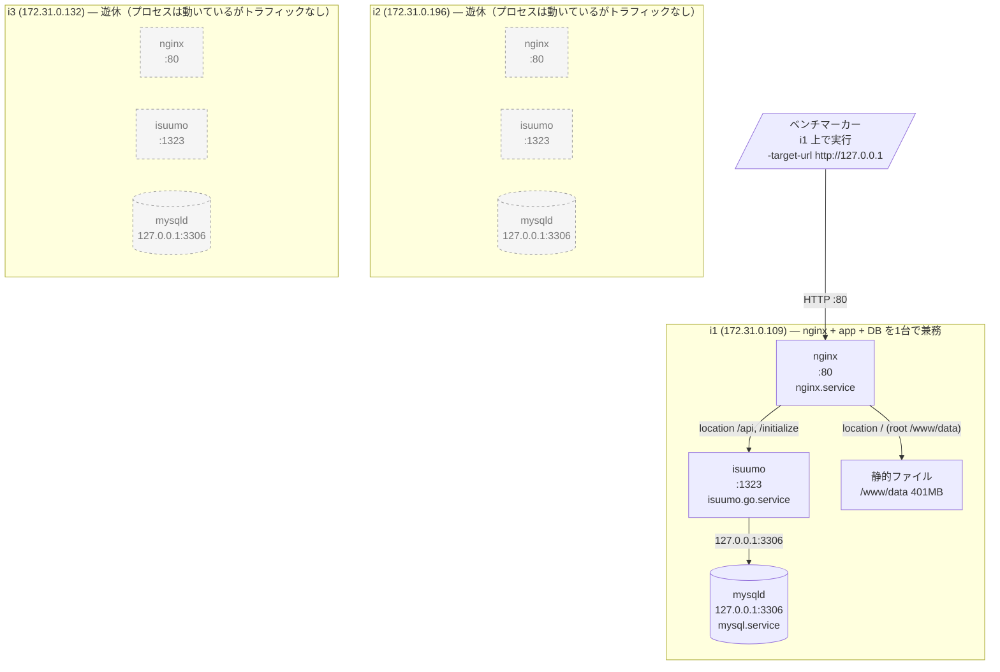

## 2. 稼働プロセス構成

### 台ごとの稼働プロセス

| ホスト | 役割 | CPU | メモリ | 動いているプロセス | LISTEN | 起動元ユニット | 備考 |
|---|---|---:|---:|---|---|---|---|
| i1 | nginx + app + db（全負荷） | 2 コア | 3.8 GB（used 383M / buff-cache 2.7G / Swap 0） | nginx（master + worker）, isuumo, mysqld, sshd, snapd, amazon-ssm-agent | `0.0.0.0:80`, `*:1323`, `127.0.0.1:3306`, `0.0.0.0:22`, `127.0.0.53:53` | `nginx.service` / `isuumo.go.service` / `mysql.service` | ベンチはこの台に対して実行する |
| i2 | **遊休** | 2 コア | 3.8 GB（used 383M / buff-cache 2.5G / Swap 0） | 同上（nginx / isuumo / mysqld すべて稼働） | `0.0.0.0:80`, `*:1323`, `127.0.0.1:3306`, `0.0.0.0:22`, `127.0.0.53:53` | 同上 | プロセスは i1 と同一構成だがトラフィックが来ていない |
| i3 | **遊休** | 2 コア | 3.8 GB（used 378M / buff-cache 2.6G / Swap 0） | 同上（nginx / isuumo / mysqld すべて稼働） | `0.0.0.0:80`, `*:1323`, `127.0.0.1:3306`, `0.0.0.0:22`, `127.0.0.53:53`, `172.31.0.132:68/udp` | 同上 | 同上 |

**「動いている」と「使われている」は別物。** 3 台とも nginx / isuumo / mysqld が `active` で同じポートを LISTEN しているが、`docs/kickoff.md` のベンチ手順が `ssh i1 'cd isuumo/bench && ./bench -target-url http://127.0.0.1'` であるとおり、**負荷が入るのは i1 だけ**。i2 / i3 は起動しているだけで 1 リクエストも受けていない。

**MySQL は 3 台とも `bind_address = 127.0.0.1`** なので、この状態では他の台からの接続を受け付けない（`app-map-raw/i{1,2,3}-mysql.txt`）。DB 権限も `isucon@localhost` のみ（`app-map-raw/db-schema.md`）。

### 想定外のプロセス

| ホスト | プロセス | CPU% | MEM% | 起動元 | 備考 |
|---|---|---:|---:|---|---|
| i1 / i2 / i3 | `snapd` | 0.0 | 数 % | `snapd.service` | AMI 由来。停止中の負荷は無い |
| i1 / i2 / i3 | `amazon-ssm-agent` / `ssm-agent-worker` | 0.0 | 数 % | `amazon-ssm-agent.service` | AWS 練習環境由来。本戦環境には無い |
| i1 | `systemd-journald` | 0.0 | 272 MB | `systemd-journald.service` | i1 でメモリ最大のプロセス。mysqld（225 MB）より大きい |

他言語の参考実装ユニット（`isuumo.deno` / `nodejs` / `perl` / `php` / `python` / `ruby` / `rust`）は**全台で `disabled` かつ `inactive`**。プロセスとして残っているものは無い（`app-map-raw/i{1,2,3}.md`）。採取時点はいずれの台もアイドルで、`ps` の %CPU 上位はすべて 0.0% のカーネルスレッドだった。

### 台ごとの差異

| 項目 | i1 | i2 | i3 |
|---|---|---|---|
| OS | Ubuntu 18.04.5 LTS / 5.4.0-1045-aws | 同左 | 同左 |
| CPU / メモリ | 2 コア Xeon 6975P-C / 3.8 GB | 同左 | 同左 |
| ディスク | 20 GB 中 8.8 GB 使用（46%） | 20 GB 中 9.0 GB 使用（47%） | 20 GB 中 9.0 GB 使用（47%） |
| nginx | 1.14.0（設定は3台完全同一） | 1.14.0（同一） | 1.14.0（同一） |
| MySQL | 5.7.42-0ubuntu0.18.04.1 | 同左 | 同左 |
| Go | ランタイムのバージョンは**未確認**（`go` が PATH に無い）。`docs/kickoff.md` の記載は 1.14.7 | 同左 | 同左 |
| アプリのユニット | `isuumo.go.service` enabled / **active** | 同左 | 同左 |
| `slow_query_log` | **ON** | OFF | OFF |
| `long_query_time` | **0.000000** | 10.000000 | 10.000000 |
| pprof（`:6060`） | 未 LISTEN | 未 LISTEN | 未 LISTEN |

**i1 だけスロークエリログの設定が違う。** `mysql/mysql.conf.d/mysqld.cnf:76-78` では `slow_query_log` はコメントアウトされたままなので、これは設定ファイル由来ではなく **`SET GLOBAL` による実行時設定**。mysqld を再起動すると OFF に戻る。

---

[← 索引に戻る](README.md) ｜ [次: リクエストの流れ →](03-request-flow.md)
