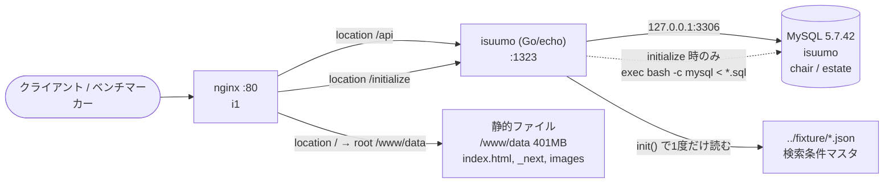

## 3. リクエストの流れ

- **静的ファイルを返しているのは誰か**: nginx。`location / { root /www/data; }`（`app-map-raw/i1-nginx.conf`）。Go アプリ側に `e.Static` などの静的配信ルートは**無い**（`go/main.go` に該当なし）。`/www/data` は 401MB で、うち `images/chair` 275MB・`images/estate` 126MB。
- **`proxy_pass` の向き先（`location` ごと）**:

  | location | 向き先 | 備考 |
  |---|---|---|
  | `/api` | `http://localhost:1323` | upstream 定義なし・keepalive なし |
  | `/initialize` | `http://localhost:1323` | 同上 |
  | `/` | （proxy せず）`root /www/data` | 静的配信 |

- **アプリ → DB の接続先**: `127.0.0.1:3306`（`go/main.go:201-209` の既定値と `/home/isucon/env.sh` の `MYSQL_HOST=127.0.0.1` が一致）。同一ホスト内で完結している。
- **追加ミドルウェア（Redis / memcached 等）の有無**: **無し**。3 台とも LISTEN しているのは 80 / 1323 / 3306 / 22 / 53 のみ（`app-map-raw/i{1,2,3}.md`）。
- **nginx の設定で実在しないパスや別の場所を指している箇所**:
  - `server` ブロック直下の `root /home/isucon/isucon10-qualify/webapp/public;` は**実在しないパス**（i1 で確認、`No such file or directory`）。`location /` の `root /www/data` に上書きされているため実害は出ていないが、この行だけを見て静的ファイルの場所を判断すると誤る。
  - `sites-enabled/isuumo.conf` は `sites-available/isuumo.conf` への symlink。PHP 用の `isuumo.php.conf` は `sites-available` にあるが有効化されていない。
- **3 台の nginx 設定は完全に同一**（`diff` で差分ゼロ）。
- **アクセスログは LTSV 形式**（`nginx/nginx.conf:22-38`）で `/var/log/nginx/access.log` に出力。alp で集計できる状態。`$request_time` / `$upstream_response_time` を含む。

---

[← 索引に戻る](README.md) ｜ [次: エンドポイント一覧 →](04-endpoints.md)
