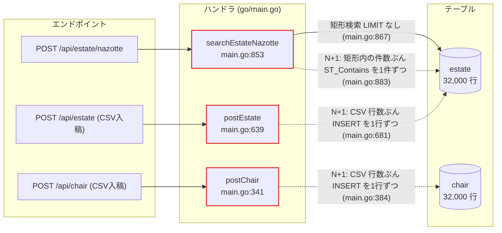
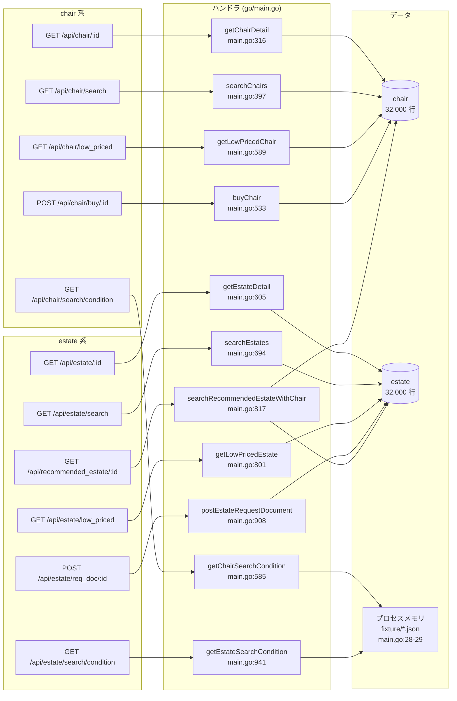

## 4. エンドポイント一覧

エンドポイントが 15 本あるため、**「N+1 / 全件走査を含むもの」と「それ以外」の 2 枚**に分けている。

### 図1: N+1 / 全件走査を含むエンドポイント

### 図2: その他のエンドポイント

### エンドポイント表

ルーティングは `go/main.go:252-270` に全件ベタ書き。フレームワークは **echo v3**（`go/main.go:243`）。全 15 本ともハンドラを開いて確認済み（未確認なし）。

| メソッド | パス | ハンドラ | 定義行 | 主なクエリ | N+1 | 備考 |
|---|---|---|---|---|:--:|---|
| POST | `/initialize` | `initialize` | `go/main.go:252`（実装 `:287`） | SQL 発行なし。`exec.Command("bash","-c","mysql … < file")` × 3（`:305`） | — | 詳細は[章6](06-initialize.md) |
| GET | `/api/chair/:id` | `getChairDetail` | `go/main.go:255`（実装 `:316`） | `SELECT * FROM chair WHERE id = ?`（`:324`） | 無 | 取得後に Go 側で `stock <= 0` を見て 404（`:333`） |
| POST | `/api/chair` | `postChair` | `go/main.go:256`（実装 `:341`） | `INSERT INTO chair …`（`:384`、for 内） | **有** | CSV 入稿。`csv.ReadAll()` で全行メモリ展開（`:353`）。**失敗すると critical error で一発失格** |
| GET | `/api/chair/search` | `searchChairs` | `go/main.go:257`（実装 `:397`） | `SELECT COUNT(*) …`（`:511`）+ `SELECT * … ORDER BY popularity DESC, id ASC LIMIT ? OFFSET ?`（`:519`） | 無 | 条件列: `price` `height` `width` `depth` `kind` `color` `features`(LIKE) `stock`。1リクエストで2クエリ |
| GET | `/api/chair/low_priced` | `getLowPricedChair` | `go/main.go:258`（実装 `:589`） | `SELECT * FROM chair WHERE stock > 0 ORDER BY price ASC, id ASC LIMIT 20`（`:591`） | 無 | |
| GET | `/api/chair/search/condition` | `getChairSearchCondition` | `go/main.go:259`（実装 `:585`） | **DB アクセスなし**。メモリ上の `chairSearchCondition` を返す | — | |
| POST | `/api/chair/buy/:id` | `buyChair` | `go/main.go:260`（実装 `:533`） | `SELECT * FROM chair WHERE id = ? AND stock > 0 FOR UPDATE`（`:560`）→ `UPDATE chair SET stock = stock - 1 WHERE id = ?`（`:570`） | 無 | **スコア加点対象（イスの購入件数）**。トランザクション |
| GET | `/api/estate/:id` | `getEstateDetail` | `go/main.go:263`（実装 `:605`） | `SELECT * FROM estate WHERE id = ?`（`:613`） | 無 | |
| POST | `/api/estate` | `postEstate` | `go/main.go:264`（実装 `:639`） | `INSERT INTO estate …`（`:681`、for 内） | **有** | CSV 入稿。**失敗すると critical error で一発失格** |
| GET | `/api/estate/search` | `searchEstates` | `go/main.go:265`（実装 `:694`） | `SELECT COUNT(*) …`（`:779`）+ `SELECT * … ORDER BY popularity DESC, id ASC LIMIT ? OFFSET ?`（`:787`） | 無 | 条件列: `door_height` `door_width` `rent` `features`(LIKE)。1リクエストで2クエリ |
| GET | `/api/estate/low_priced` | `getLowPricedEstate` | `go/main.go:266`（実装 `:801`） | `SELECT * FROM estate ORDER BY rent ASC, id ASC LIMIT 20`（`:803`） | 無 | WHERE 句なし |
| POST | `/api/estate/req_doc/:id` | `postEstateRequestDocument` | `go/main.go:267`（実装 `:908`） | `SELECT * FROM estate WHERE id = ?`（`:928`） | 無 | **スコア加点対象（資料請求件数）**。email は検証も保存もしない |
| POST | `/api/estate/nazotte` | `searchEstateNazotte` | `go/main.go:268`（実装 `:853`） | `SELECT * FROM estate WHERE latitude <= ? AND … ORDER BY popularity DESC, id ASC`（`:867`、**LIMIT なし**）+ ループ内 `SELECT * FROM estate WHERE id = ? AND ST_Contains(…)`（`:883`） | **有** | 詳細は下記 |
| GET | `/api/estate/search/condition` | `getEstateSearchCondition` | `go/main.go:269`（実装 `:941`） | **DB アクセスなし**。メモリ上の `estateSearchCondition` を返す | — | |
| GET | `/api/recommended_estate/:id` | `searchRecommendedEstateWithChair` | `go/main.go:270`（実装 `:817`） | `SELECT * FROM chair WHERE id = ?`（`:825`）+ `SELECT * FROM estate WHERE (door_width >= ? AND door_height >= ?) OR …（6組の OR）… ORDER BY popularity DESC, id ASC LIMIT 20`（`:840`） | 無 | 椅子の 3 辺から 2 辺を選ぶ順列 6 通りを OR で並べている |

- **総数: 15 本**（`/initialize` を含む）
- **うち N+1 を含むもの: 3 本**（`POST /api/estate/nazotte`、`POST /api/chair`、`POST /api/estate`）
- **スコア加点に直結するもの**: スコア = (イスの購入件数 + 物件の資料請求件数) − 減点 なので、`POST /api/chair/buy/:id` と `POST /api/estate/req_doc/:id` の 2 本。ただしそこに到達するまでの検索系（`search` / `low_priced` / `nazotte` / `recommended_estate`）が詰まると加点も止まる。
- **ベンチが叩かないもの**: 静的ファイル（画像・HTML）。マニュアル「画像や HTML などの静的ファイルに対するリクエストは行われません」。ただし追試でブラウザ表示は確認される。

### `POST /api/estate/nazotte` の構造（`go/main.go:853-906`）

1. `c.Bind(&coordinates)` でポリゴン頂点を受ける（`:855`）。空なら 400（`:861`）。
2. Go 側で全頂点を走査して緯度経度の min/max を求める（`getBoundingBox()`、`:945-971`）。
3. **LIMIT なし**の矩形範囲検索で矩形内の estate を全件 Go のスライスへ（`:867-868`）。`latitude` / `longitude` にインデックスは無い。
4. スライスの各要素について **1 件ずつ** `SELECT * FROM estate WHERE id = ? AND ST_Contains(ST_PolygonFromText(…), ST_GeomFromText(…))` を発行（`:878-894`）。SQL 文字列は毎回 `fmt.Sprintf` で組み直し、`coordinatesToText()`（`:973-979`）もループ内で毎回呼ばれる。
5. 50 件（`NazotteLimit`、`:24`）への切り詰めは**ループが終わったあと**（`:898-902`）なので、クエリ回数は減らない。`Count` は切り詰め**後**の件数（`:903`）。

`docs/kickoff.md` に「素の状態では `POST /api/estate/nazotte` のタイムアウトが数件出るが正常」と記録されているのはこの構造による。

### 全ハンドラに共通する事項

- 参照系はすべて `SELECT *`。**JOIN は 1 箇所も無い**（テーブルが 2 つで関連が無いため）。
- `features` の絞り込みは**前方一致でない LIKE**: `features LIKE CONCAT('%', ?, '%')`（chair: `:481` / estate: `:751`）。カンマ区切りの要素数ぶん AND で積まれる。
- 検索条件は `strings.Join(conditions, " AND ")` で文字列結合（`:507`, `:775`）。値はプレースホルダで渡している。`sqlx.In` の使用は無し。
- `context` 版 API（`GetContext` / `SelectContext`）は 0 件。すべて非 context 版。
- トランザクションは `postChair`（`:359-393`）/ `postEstate`（`:657-690`）/ `buyChair`（`:552-580`）の 3 箇所。いずれも `defer tx.Rollback()` あり。
- ページングは `page` / `perPage` を `strconv.Atoi` するのみで**値域チェックなし**（`:493-503`, `:761-771`）。`page` は 0 始まりで `LIMIT ? OFFSET ?` に `perPage`, `page*perPage` を渡す。
- **bot 判定・UA チェックはアプリ側に存在しない**（`User-Agent` の参照が 0 件）。ミドルウェアは Logger と Recover のみ（`:248-249`）。マニュアルが 503 を許可している bot の UA 正規表現は[章9](09-constraints.md)を参照。

---

[← 索引に戻る](README.md) ｜ [次: データモデル →](05-schema.md)
