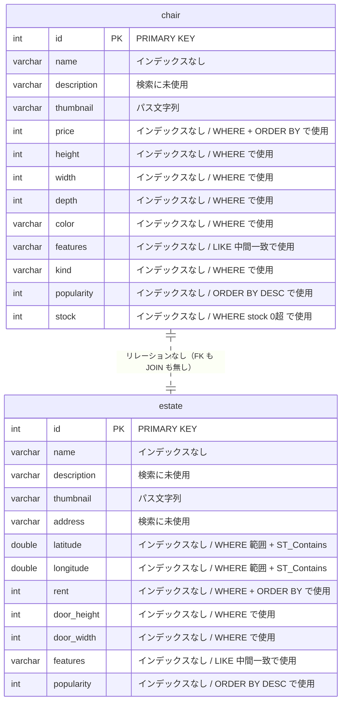

## 5. データモデル



**テーブルは 2 つだけで、両者の間にリレーションは無い。** 外部キー制約も無く、コード上の JOIN も 1 箇所も無い（`go/main.go` に `JOIN` なし）。`GET /api/recommended_estate/:id`（`go/main.go:817`）だけが「chair を 1 件引いてその寸法を条件に estate を引く」という形でアプリ側で 2 テーブルを繋いでいるが、SQL としては別々のクエリ。

| テーブル | 行数 | データ長 | インデックス長 | 主キー | その他のインデックス |
|---|---:|---:|---:|---|---|
| `chair` | 32,000 | 13,840 KB | **0 KB** | `id` | **無し** |
| `estate` | 32,000 | 14,864 KB | **0 KB** | `id` | **無し** |

出典: `app-map-raw/db-schema.md`。カーディナリティは `chair.PRIMARY` = 29,246、`estate.PRIMARY` = 29,271（統計値のため実行数と一致しない）。

**インデックス長が両テーブルとも 0 KB** = セカンダリインデックスが 1 本も存在しない。`mysql/db/0_Schema.sql` の `CREATE TABLE` にも `PRIMARY KEY` 以外の索引定義は無い。

### インデックスが無い検索条件

エンドポイント（[章4](04-endpoints.md)）のクエリと `app-map-raw/db-schema.md` のインデックス一覧を突き合わせた結果。**`id` 以外のすべての検索・整列がフルスキャン + filesort になる。**

| テーブル | 列 | 使われ方 | 使っているエンドポイント |
|---|---|---|---|
| `chair` | `popularity` | ORDER BY DESC（第1キー） | `GET /api/chair/search`（`go/main.go:519`） |
| `chair` | `price` | WHERE 範囲 / ORDER BY ASC | `GET /api/chair/search`（`:408-415`）、`GET /api/chair/low_priced`（`:591`） |
| `chair` | `stock` | WHERE `stock > 0` | `GET /api/chair/search`（`:491`）、`GET /api/chair/low_priced`（`:591`）、`POST /api/chair/buy/:id`（`:560`） |
| `chair` | `height` / `width` / `depth` | WHERE 範囲 | `GET /api/chair/search`（`:425-466`） |
| `chair` | `kind` / `color` | WHERE 等値 | `GET /api/chair/search`（`:468-479`） |
| `chair` | `features` | WHERE `LIKE CONCAT('%',?,'%')`（中間一致） | `GET /api/chair/search`（`:481`） |
| `estate` | `popularity` | ORDER BY DESC（第1キー） | `GET /api/estate/search`（`:787`）、`POST /api/estate/nazotte`（`:867`）、`GET /api/recommended_estate/:id`（`:840`） |
| `estate` | `rent` | WHERE 範囲 / ORDER BY ASC | `GET /api/estate/search`（`:705-712`）、`GET /api/estate/low_priced`（`:803`） |
| `estate` | `door_height` / `door_width` | WHERE 範囲 / OR 6 組 | `GET /api/estate/search`（`:722-746`）、`GET /api/recommended_estate/:id`（`:840`） |
| `estate` | `features` | WHERE `like concat('%',?,'%')`（中間一致） | `GET /api/estate/search`（`:751`） |
| `estate` | `latitude` / `longitude` | WHERE 範囲（矩形）+ `ST_Contains` の対象 | `POST /api/estate/nazotte`（`:867`, `:883`） |

**空間インデックス（SPATIAL）も無い。** `estate` は `latitude` / `longitude` を `DOUBLE` の別カラムとして持っており、`GEOMETRY` 型の列は存在しない（`mysql/db/0_Schema.sql`）。そのため `ST_Contains` は `id` 指定の 1 行に対してしか適用できない構造になっている。

### 外部キー

**無し**（`app-map-raw/db-schema.md`「外部キー制約なし」）。`chair` と `estate` は独立したテーブル。

### スキーマ定義（`mysql/db/0_Schema.sql`）

```sql
DROP DATABASE IF EXISTS isuumo;
CREATE DATABASE isuumo;

DROP TABLE IF EXISTS isuumo.estate;
DROP TABLE IF EXISTS isuumo.chair;

CREATE TABLE isuumo.estate
(
    id          INTEGER             NOT NULL PRIMARY KEY,
    name        VARCHAR(64)         NOT NULL,
    description VARCHAR(4096)       NOT NULL,
    thumbnail   VARCHAR(128)        NOT NULL,
    address     VARCHAR(128)        NOT NULL,
    latitude    DOUBLE PRECISION    NOT NULL,
    longitude   DOUBLE PRECISION    NOT NULL,
    rent        INTEGER             NOT NULL,
    door_height INTEGER             NOT NULL,
    door_width  INTEGER             NOT NULL,
    features    VARCHAR(64)         NOT NULL,
    popularity  INTEGER             NOT NULL
);

CREATE TABLE isuumo.chair
(
    id          INTEGER         NOT NULL PRIMARY KEY,
    name        VARCHAR(64)     NOT NULL,
    description VARCHAR(4096)   NOT NULL,
    thumbnail   VARCHAR(128)    NOT NULL,
    price       INTEGER         NOT NULL,
    height      INTEGER         NOT NULL,
    width       INTEGER         NOT NULL,
    depth       INTEGER         NOT NULL,
    color       VARCHAR(64)     NOT NULL,
    features    VARCHAR(64)     NOT NULL,
    kind        VARCHAR(64)     NOT NULL,
    popularity  INTEGER         NOT NULL,
    stock       INTEGER         NOT NULL
);
```

**このファイルはエンジン指定が無い**が、稼働中のテーブルは `ENGINE=InnoDB DEFAULT CHARSET=utf8mb4`（`app-map-raw/db-schema.md`）。

---

[← 索引に戻る](README.md) ｜ [次: 初期化処理 →](06-initialize.md)
