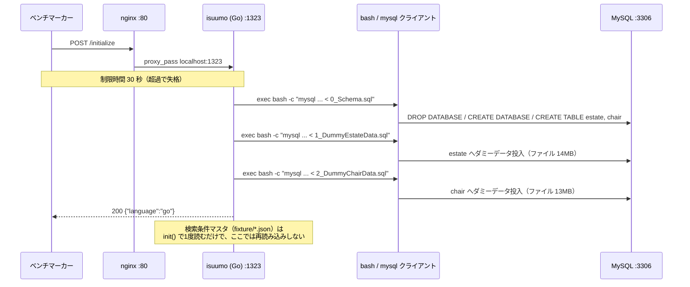

## 6. 初期化処理

- **エンドポイント**: `POST /initialize`（ルーティング `go/main.go:252`、実装 `initialize` `go/main.go:287-314`）
- **制限時間**: **30 秒**（超過で失格。`docs/isucon10_qualify_manual.md` 制約事項）。main.go 側にタイムアウトの記述は無い。
- **レスポンス形式**: `200` + `{"language":"go"}`（`InitializeResponse`、`go/main.go:31-33`, `:311-313`）。失敗時は `500`（`:306-308`）。**`language` が空だとベンチが失敗扱いにする**（`docs/kickoff.md`）。
- **やっていること**:
  1. SQL ディレクトリを `filepath.Join("..", "mysql", "db")` として解決（`go/main.go:288`）。`go/` から見た相対パスなので、**`WorkingDirectory=/home/isucon/isuumo/webapp/go` に依存する**（`isuumo.go.service`）。
  2. 次の 3 ファイルを**この順で**流す（`go/main.go:290-292`）。
     | 順 | ファイル | サイズ | 内容 |
     |---|---|---:|---|
     | 1 | `mysql/db/0_Schema.sql` | 1.3 KB | `DROP DATABASE isuumo` → `CREATE DATABASE` → `estate` / `chair` の `CREATE TABLE` |
     | 2 | `mysql/db/1_DummyEstateData.sql` | 14 MB | `estate` 32,000 行の INSERT |
     | 3 | `mysql/db/2_DummyChairData.sql` | 13 MB | `chair` 32,000 行の INSERT |
  3. 各ファイルを `filepath.Abs` で絶対パス化し、`mysql -h <Host> -u <User> -p<Pass> -P <Port> <DBName> < <sqlFile>` を **`exec.Command("bash", "-c", cmdStr).Run()` で外部プロセスとして逐次実行**（`go/main.go:296-305`）。アプリの DB コネクション（`db`）は使っていない。
  4. 3 本とも成功したら `{"language":"go"}` を返す。
- **変更時に守るべき整合性** — スキーマを変える / テーブルを分ける / キャッシュを持つ場合に、ここも直す必要があるもの:
  - **インデックスを足す場合**、`0_Schema.sql` に `ALTER TABLE` / `CREATE INDEX` を書くか、`initialize` の中で追加で流す。`initialize` は毎回 `DROP DATABASE` から始まるので、**手で `CREATE INDEX` しても次のベンチで消える。**
  - **テーブルを追加・分割した場合**、`0_Schema.sql` の `DROP TABLE` / `CREATE TABLE` に追加し、データ投入も `initialize` の中で再現する。ダミーデータ SQL は `estate` / `chair` にしか INSERT しないので、派生テーブルは `initialize` 内で `INSERT ... SELECT` するなどして埋める必要がある。
  - **アプリ側にキャッシュを持つ場合**、`initialize` でクリアする処理を足す。現状の `initialize` は Go 側の状態に一切触れていない。
  - ダミーデータ SQL の `INSERT` は**列名を明示している**（`INSERT INTO isuumo.estate (id, thumbnail, name, …) VALUES …`）ので、列を追加するぶんには SQL 側の修正は不要。列を削る / 型を変える場合は直す必要がある。なお両ファイルとも 1 行 1 レコードではなく **59 本の複数行 INSERT**（1 本あたり約 542 行）にまとまっている。
- **初期化が消さないもの**:
  - **検索条件マスタ（`chairSearchCondition` / `estateSearchCondition`、`go/main.go:28-29`）。** `init()`（`go/main.go:225-239`）で `../fixture/chair_condition.json` と `../fixture/estate_condition.json` を 1 度だけ読み込み、**`/initialize` では再読み込みされない。** 読み取り専用で書き換え箇所が無いため現状は問題にならないが、ここに動的なキャッシュを足すとベンチ 2 回目以降に壊れる。
  - `/www/data` の静的ファイル（nginx 配信）。DB とは無関係。
  - **プロセスメモリに持っている状態はこの 2 変数のみ**で、カウンタ・セッション・キャッシュの類は無い（[章8](08-dependencies.md)）。
- **現在の所要時間は未計測（未確認）。** 27MB の SQL を `mysql` クライアント経由で流しているので、30 秒制限に対する余裕は計測して確かめる必要がある。

---

[← 索引に戻る](README.md) ｜ [次: 設定の現状 →](07-settings.md)
